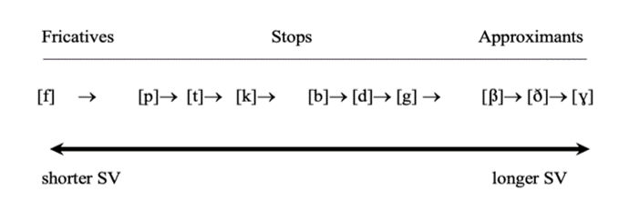
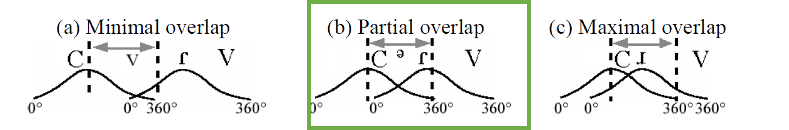
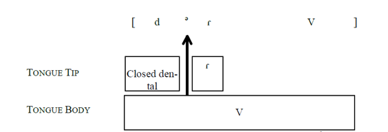
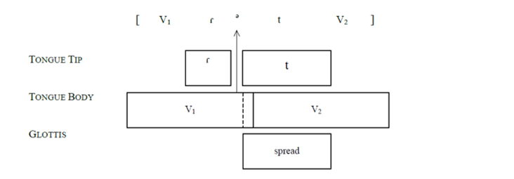
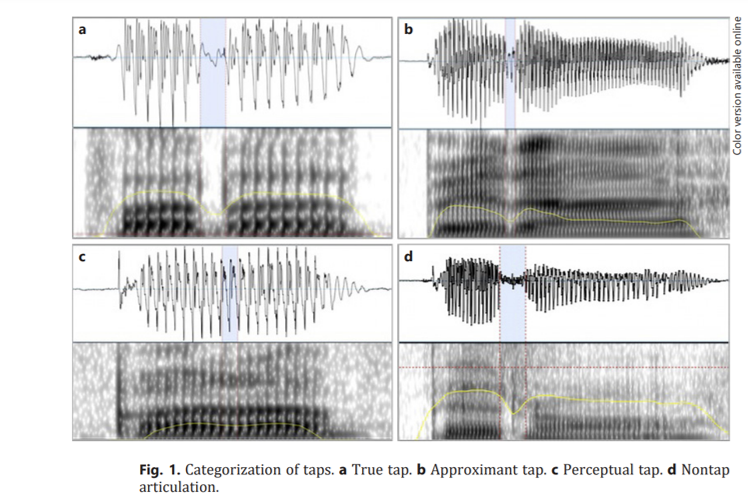

<!-- this adds the link footer to all slides, depends on my-footer class in css-->


```{css, echo = F}
.regression table {
  font-size: 12px;     
}
.caption {
  font-size: .6rem;
}

```

```{r setup, include=FALSE}
knitr::opts_chunk$set(echo = FALSE)
library(firatheme)
library(tidyverse)
library(xaringanthemer)
    library(ggplot2)
    library(tikzDevice)
 options(tikzLatexPackages = c(getOption("tikzLatexPackages"),
                                  "\\usepackage{tipa}",
                                  "\\usepackage{qtree}"))
```

```{r}
xaringanExtra::use_logo(
  image_url = "logo.png",
  position = xaringanExtra::css_position(top = "1em", right = "1em")
)
```

```{r xaringan-themer, include=FALSE, warning=FALSE}
library(xaringanthemer)
style_mono_accent(
  base_color = "#399ba3",
  header_font_google = google_font("Times New Roman"),
  text_font_google   = google_font("Times New Roman", "300", "300i"),
  code_font_google   = google_font("Times New Roman"),
    text_font_size = "1rem",
  header_h1_font_size = "1.7rem",
    header_h2_font_size = "1.5rem",

    header_h3_font_size = "1.2rem"

  

)


```


```{r xaringan-panelset2, echo=FALSE}
xaringanExtra::use_panelset()
```
# Heritage bilingualism


- Heritage speakers (HS):  **Early bilinguals** with a societal minority language at home and are exposed to a societal majority language in the community. 

  * Early bilingual phonological grammars interact during early childhood (Fabiano-Smith & Barlow, 2010; Lleó, 2018; Meziane & MacLeod, 2021; Paradis, 2001). 


  * Dominance shift heritage language → majority language during **primary school** <font size="2">(Benmamoun, Montrul, & Polinsky, 2013; Flores & Rato, 2016; Kupisch et al., 2015; Lloyd-Smith, Einfeldt, & Kupisch,2020; Polinsky & Scontras, 2020; Valdés, 2014)</font>.
 

  * Adult HS demonstrate areas of **vulnerability in the heritage language** (HL):  divergent productions from monolingual norms, cross-linguistic transfer from the dominant language <font size="2">(Amengual, 2012, 2016; Kim, 2017; Rao, 2014; Ronquest, 2013)</font>, output variation <font size="2">(Kupisch, 2020)</font>, 'heritage accent' <font size="2">(Flores & Rato, 2016; Kupisch et al., 2015; Lloyd-Smith et al., 2020).</font>


 

  
  - **Are the divergent outputs found during adulthood (attrition of the heritage language) or do they arise during early grammar interaction**?


---

# Areas of vulnerability


- HSs mostly maintain separate **phonemic contrasts** <font size="2">(Chang et al., 2011; Llama & López-Morelos, 2016; Saadah, 2011; Tse, 2016)</font>.

- HSs demonstrate output variation and ‘intermediate values’ in their **phonetic implementation** <font size="2">(Amengual, 2016, 2018; Chang & Yao, 2016; Kim, 2011)</font>.


- Less studied area in HSs speech production is that of coarticulation. Although the effects of coarticulation are often not audible <font size="2">(Farnetani & Recasens, 2010)</font> and, thus, less likely to contribute to a global heritage accent, understanding variation in language-specific **gestural organization** can shed light on the architecture of heritage language grammars. 


- Coordination of tautosyllabic and heterosyllabic consonant clusters involving a tap (i.e.,/Cɾ/, /ɾ.C/).
  

```{r, eval = FALSE, include = FALSE}

How robust are these representations and how does this robustness change as heritage speakers develop their grammars?

HSs maintain phonemic contrasts, but show variation in implementation of phonetic detail <font size="2">(Kupisch et al., 2020)</font>.

```


---

# Spanish /Cɾ/ and /ɾC/ clusters

- Spanish tap is produced with a primary gesture of the tip of the tongue involving a single rapid ballistic movement (hit-and-run) with the alveolar ridge and a secondary uvular gesture of the tongue body <font size="2">(Proctor, 2011)</font>. 

In consonant clusters:

-	Tautosyllabic position
  *	[tɾen] tren ‘train’  
  *	[fɾe.sa] fresa ‘strawberry’
  *	[o.ɣɾo] ogro ‘ogre’
  *	[gɾan.xa] granja ‘farm’
-	Heterosyllabic position
  *	[aɾ.βol] árbol  ‘tree’
  *	[aɾ.ma.ɾjo] armario ‘closet’
  *	[peɾ.fek.to] perfecto ‘perfect’

---

# Spanish /Cɾ/ and /ɾ.C/ gestural coordination

- Spanish consonant clusters containing a tap (e.g., /Cɾ/ ‘tronco’ and /ɾ.C/ ‘árbol’) optionally surface with an **intrusive vowel (IV)** ' (e.g., /ɾə.C/ or /Cəɾ/) ranging from 63% to 97.7%  <font size="2">(Blecua, 2001; Colantoni and Steele, 2006; Ramirez, 2006; Schmeiser, 2020)</font>.

- IVs are invisible to the phonology (e.g., no repair of syllabic structure, invisible to stress assignment) and may be a by-product of consonant coarticulation. 

- Intrusive vowels are not stable in their durational properties <font size="2">(Gili Gaya, 1921)</font>.  Generally, IV duration is similar to that of an unstressed vowel <font size="2">(Malmberg, 1965: 10, 35)</font>, and appears to be longer to that of the tap (27.9 ms vs. 20.5 ms) <font size="2">(Blecua, 2001; Gil Gaya, 1921)</font>. 


```{r, echo = FALSE, out.width = "400px", fig.cap = 'IV duration in Schmeiser (2020)'}



# Rate of EVs range across studies: 

#|                             | /Cɾ/                                         | /ɾ.C/           |
#|-----------------------------|----------------------------------------------|-----------------|
#| Schmeiser (2020)            | 64.16%                                       | -               |
#| Blecua (2001)               | 63%                                          | -               |
#| Ramírez (2006)              | 68%                                          |                 |
#| Colantoni and Steele (2005) | /fɾ/ 84.9%  /ptk/+ ɾ 94.2%  /b d g/ + ɾ 97.7% |                 #|
#| Schmeiser (2009)            |                                              | 81.1% in Mexico |
#| Gili Gaya (1921)            |                                              | 61.2%           |

```

- The quality of the vocalic element is similar to the tautosyllabic or neighboring vowels, but not identical <font size="2"> (Blecua, 2001)</font>.


---

# Spanish /Cɾ/ and /ɾC/ clusters


- Articulatory phonology <font size="2">(Browman and Goldstein 1989, 1990, 1991:Gafos, 1999, 2002)</font>:

  * Grammar operates on dynamically defined articulatory gestures which are coordinated in-phase (i.e., sinchronously) or in anti-phase (i.e., sequentially).
  * Consonants superimposed on vowel gesture.
  * Low degree of overlap between consonantal gestures allows for open transitions.
  
  
- IVs are a result of low consonant overlap arguably motivated by perceptual recoverability of the tap gesture <font size="2">(Bradley, 2002, 2006; Gibson, 2019, Romero, 2008; Hall, 2003)</font>.


```{r, echo = FALSE, out.width = "600px", fig.cap = 'Schematic IV insertion from Bradley, 2006'}



# Rate of EVs range across studies: 

#|                             | /Cɾ/                                         | /ɾ.C/           |
#|-----------------------------|----------------------------------------------|-----------------|
#| Schmeiser (2020)            | 64.16%                                       | -               |
#| Blecua (2001)               | 63%                                          | -               |
#| Ramírez (2006)              | 68%                                          |                 |
#| Colantoni and Steele (2005) | /fɾ/ 84.9%  /ptk/+ ɾ 94.2%  /b d g/ + ɾ 97.7% |                 #|
#| Schmeiser (2009)            |                                              | 81.1% in Mexico |
#| Gili Gaya (1921)            |                                              | 61.2%           |

```


  


```{r, include = FALSE, eval=FALSE}

|            | /Cɾ/                                    | /ɾ.C/                |
|------------|-----------------------------------------|----------------------|
| Frequency  | between 84% (fricative) and 97% (stops) | 81.1 % in Mexican speakers <font size="2">(Schmeiser, 2009)</font>              |
| Moderators | voicing                                | voicing, stress, place of articulation (heterorganic vs. homorganic) |
| Gestural   | execution of the release phase of the rhotic, which separates the tap constriction from that of the following consonant, ensuring an open transition between the two <font size="2">(Bradley, 2004)</font>                            | pillow               |
 


SV duration varies according to
how similar the two consonants in the cluster are in terms of
obstruent voicing, manner of articulation, and place of
articulation
It is a standard working hypothesis in the study of speech that phonological units
(such as segments or syllables or higher structures such as feet or prosodic words) are
embodied in actions of the speech gestures that constitute these units. Yet, variation
in interarticulatory timing, in particular, has proven nettlesome in teasing apart the
phonologically encoded constraints that act on the dynamic actions of the different
articulators and the low level biomechanical constraints that may affect interarticulatory
timing (Gafos & Goldstein, 2012).
- EVs appear at rates of 85% and 97%, more often in /Cɾ/ than in /ɾ.C/ and duration is 

Schmeiser (2020)
Of the 812 total /CR/ clusters examined, 521 /CR/ clusters
contained SVs and a Spanish tap, resulting in an occurrence rate
of 64.16%, a percentage in line with Blecua’s study (2001:
63%) on rhotics, and Ramírez (2006: 68%). In what follows, I
offer for each hypothesis a graph of the mean SV duration for
each factor tested.


That is, intrasegmental timing
(the timing between the laryngeal abduction gesture and the oral constriction for the
stop) interacts with intersegmental timing (the lag between the two oral constrictions
of the /k/ and the /l/).

so-called intrusive vocoid that often appears between the two
consonants in Spanish onset clusters (Bradley, 2006; Gili Gaya, 1921; Lenz, 1892;
Malmberg, 1965; Menéndez Pidal, 1926)


In sum, our assessment of overlap in clusters reveals the following results. As predicted
in H3, IPI was found to be modulated by the gesture that occupies the C2 position.
IPI was significantly higher in clusters where the C2 is a tap as compared to laterals.
C1 place was also found to affect the overlap of the gestural plateaus in both stop
+ lateral and voiceless stop + tap clusters. Additionally, we hypothesized in the Introduction
that Spanish would pattern with French with regard to low gestural overlap
for voiceless stop clusters (H3) and would show no effect of C1 voicing on intergestural
timing in C1C2 clusters (H3). Our predictions were partially confirmed in that
Spanish clusters are characterized by low gestural overlap. However, in contrast to
French, this interval is additionally modulated by the voicing specification of C1,
which resembles Bombien and Hoole’s (2013) finding on German but not on French
(we return to this finding in the Discussion section). Finally, the results indicate that
overlap in our data is not modulated by the vowel that follows the consonant clusters.


Colantoni et al 


B Schmeiser

no difference in voicing for rC

- word position:
  - order of constriction: longer IVs in front to back order of cosntriction than back to front
- manner of articulation: stops will evidence the shortest duration, followed by approximants, and nasals
- plac of articulation: labials will evidence the shortest duration followed by coronals and dorsals

Intrusive vowel duration: 
  
  longer iV after a voiced consonant than a voiceless one

fewer research in rC than cr (only Romero 1996, 2008, Bradley 2004) have included vowel intrusion in rC clusters

Gili Gaya 1921: /rC/ tokens 61.2% contain an EV in all clusters in which a tap was realized.


Bradley (2004): /rd/ execution of the release phase of the rhotic, which separates the tap constriction from that of the following consonant, ensuring an open transition between the two

Romero (2008): IV epiphenomena by product of the temporal overlap between articulatory gestures, not the result of a deliberate process of insertion


Colantoni and Steele (In press) argue that epenthesis is a dissimilatory process which
serves to increase the articulatory and perceptual difference between the stop and rhotic.

Such vocalic elements appear to be at the interface between phonetics and phonology. The degree to which such vowels are phonologized is debated.


Such intrusive vocoids (IV henceforth) indicate a low consonant-to-consonant overlap and a high degree of intergestural timing, which, moreover, has been found to be modulated by voicing (Gibson et al., 2019). Unlike in Spanish, consonant clusters containing /ɹ/ in English (e.g., crow [kɹo]) do not demonstrate vocalic epenthesis (Colantoni & Steele, 2006). We predict that the probabilistic nature of IVs along with the higher gestural overlap in English will likely result in lower rates of IVs in Spanish HSs when compared to Spanish speakers raised in monolingual environments.


```


---

# Spanish /Cɾ/ and /ɾC/ clusters


**/Cɾ/**

C1 and C2 have a stable timing relationship between each other and with the nucleic vowel (in-phase relationship).

```{r, echo = FALSE, out.width = "400px", fig.cap = 'Schmeiser, 2009'}


```


**/ɾC/**

The IV is between two heterosyllabic consonants and has a less stable timing relationship (anti-phase) with the nuclear vowel.


```{r, echo = FALSE, out.width = "400px", fig.cap = 'Schmeiser, 2009'}


```


---

# English /Cɹ/ /ɹC/ clusters

- Taps in American English surface as a result of the application of the flapping rule in V_V environments (e.g., bu[ɾ]er). 

- Otherwise, American English has a voiced alveolar approximant in the phonemic inventory (i.e., [ɹ]) which surfaces in consonant clusters (e.g., [bɹeɪn] brain [ɑɹm] arm).

- Consonant clusters in English exhibit considerable temporal overlap and negligible rates of intrusive vowels (Catford 1988).

```{r, echo = FALSE, out.width = "600px", fig.cap = 'Schemativ IV from Bradley, 2006'}
knitr::include_graphics("./maximal_overlap.png")

```
---

# Acquisition of tap in consonant clusters


- Spanish monolingual children <font size="2">(Torres et al., 2016)</font> :

|    | onset  (e.g., [ka.ɾa] 'face')  | coda  (e.g., [maɾ] 'sea') | consonant cluster (e.g., [tɾon.ko] 'log') |
|-----------------------------|----------------------------------------------|-----------------|----------------|
| 3.00 – 3.05       | 57.1%     | 27.7%          |  **27.4%** | 
|3.06 – 3.11      | 54.3%    | 53.7%         |  **38.1%** | 
| 4.00 – 4.05       | 91.4%     | 81.8%        |  **71.4%** | 
| 4.06 – 4.11      | 98.1%    | 82.3%          |  **84.5%** | 

-  Bilingual preschoolers (aged 3;0 - 4;0): lower accuracy rates than monolinguals (25% vs. 33%) & bilingual school age children: 80% threshold of tap production around age 7;1 in word-medial position <font size="2">(Menke, 2018)</font>.
---

# Acquisition of tap in consonant clusters


- Adult heritage speakers: true taps, approximant taps, or perceptual taps based. Variants depend  on dominance and language use with older generation <font size="2">(Amengual, 2016;Kim and Repiso-Puigdelliura, 2020)</font>.

- IVs are reported in studies of the tap in Spanish heritage speakers <font size="2">(Kim and Repiso-Puigdelliura, 2020)</font>.


```{r, echo = FALSE, out.width = "550px", fig.cap = 'Kim & Repiso-Puigdelliura, 2020'}


```


---

# Acquisition of tap in consonant clusters

- Rate of IV increases with Spanish proficiency <font size="2">Colantoni and Steele (2006)</font>.

  - Intermediate L2 learners lower rates of EVs → related to mastery of tap realization.

  - Higher rate of epenthesis in voiced clusters than in voiceless clusters.


|                   | Intermediate learners | Advanced  learners | Native speakers |
|-------------------|-----------------------|--------------------|-----------------|
| voiceless stop + ɾ | 24%                   | 80%                | 94%             |
| voiced stop +   ɾ  | 79%                   | 97%                | 97%             |


---

# Research questions

**Phonetic context**

RQ1: Is presence and duration of IV affected by segmental features such as voicing and place of articulation?

HA: **Perceptual recoverability**: Shared features with the tap (e.g., voicing, coronal) will be likely to lead to greater rates of IVs.


RQ2: Is presence and duration of IV affected by strength of lingual constriction (**mastery of tap realization**?

HA: **Articulatory based account**: Stronger lingual constrictions will be more likely to encode low gestural overlap. 


---

# Research questions


RQ3: Does gestural coordination show development between the ages of 5 and when compared to adults?


- Development of speech motor control will result in more variable occurrence of IV and durational differences.

---

# Research questions


RQ4a: Does transfer in the gestural specification of /ɾC/ and /Cɾ/ clusters arise between the Spanish and English grammars in Spanish heritage speakers (HSs)? If so, as Spanish heritage speakers develop their two grammars, do they show a different pattern of gestural specification?


- RQ4a:

HA:  If transfer arises between the Spanish and English grammars, Spanish HSs will produce lower rates of IVs with shorter duration when compared to SpanMonoSs.

RQ4b: 


- HA1: **Shift in language dominance**: adult HSs will present more gestural overlap (i.e., lower rates of IV with shorter duration) than child HSs.

- HA2: **Early grammar interaction**: child HSs will present more gestural overlap than adult HSs.


---

# Participants

```{r, include = FALSE}
# Calculate mean and sd for input and output
EV = read.csv('annotation_rhotics_may.CSV')
summary_participants= EV %>% dplyr::group_by(type.speaker.y, group) %>% dplyr::summarize(mean_input = mean(Spanish.input, na.rm = TRUE), sd_input = sd(Spanish.input, na.rm = TRUE),mean_output = mean(Spanish.output, na.rm = TRUE), sd_output = sd(Spanish.output, na.rm = TRUE),mean_age = mean(age, na.rm = TRUE), sd_age = sd(age, na.rm = TRUE),mean_aoaspanish = mean(AOASpanish, na.rm = TRUE), sd_aoaspanish = sd(AOASpanish, na.rm = TRUE),mean_aoaenglish = mean(AOAEnglish, na.rm = TRUE), sd_aoaenglish = sd(AOAEnglish, na.rm = TRUE))

distinct = EV %>% dplyr::group_by(type.speaker.y, group) %>% 
    dplyr::distinct(Participant1) %>%
    dplyr::summarize(count = n_distinct(Participant1))

caregivers = EV %>% dplyr::group_by(Participant1, type.speaker.y, group) %>% 
    
    dplyr::count(Caregivers)

caregivers_count = caregivers %>% dplyr::group_by( type.speaker.y) %>% 
    
    dplyr::count(Caregivers)

```


**Heritage speakers**

* `r sum(distinct$count[distinct$type.speaker.y == "HSs"])` participants born in the US or arrived in the US before the age of 3.
*  Exposed to Spanish since birth and to English before the age of 5. 
*   Had at least one caregiver that emigrated from Mexico  (N = `r sum(caregivers_count$n[caregivers_count$type.speaker.y == "HSs" & caregivers_count$Caregivers == "mexico"], na.rm = TRUE)`, N = `r sum(caregivers_count$n[caregivers_count$type.speaker.y == "HSs" & caregivers_count$Caregivers == "mixed"], na.rm = TRUE)` with 1 caregiver from Mexico and 1 caregiver from an English-speaking country, N = `r sum(caregivers_count$n[caregivers_count$type.speaker.y == "HSs" & caregivers_count$Caregivers == "heritage1"], na.rm = TRUE)` with 1 caregiver from Mexico and 1 HSs.


| Heritage Speakers | N (Ages)               | Spanish input (SD) | Spanish output (SD) |
|-------------------------------------|------------------------|-----------------------------|------------------------------|
  | younger children                    | N = `r distinct$count[distinct$type.speaker.y == "HSs" & distinct$group == "a_child"]` ( Mean age = `r round(summary_participants$mean_age[summary_participants$type.speaker.y == "HSs" & summary_participants$group == "a_child"], digits=2)` months [`r round(summary_participants$sd_age[summary_participants$type.speaker.y == "HSs" & summary_participants$group == "a_child"], digits=2)`])    | `r round(summary_participants$mean_input[summary_participants$type.speaker.y == "HSs" & summary_participants$group == "a_child"], digits=2)*100`%[`r round(summary_participants$sd_input[summary_participants$type.speaker.y == "HSs" & summary_participants$group == "a_child"], digits=2)*100`%]          | `r round(summary_participants$mean_output[summary_participants$type.speaker.y == "HSs" & summary_participants$group == "a_child"], digits=2)*100`%[`r round(summary_participants$sd_output[summary_participants$type.speaker.y == "HSs" & summary_participants$group == "a_child"], digits=2)*100`%]                 |
| older children                      | N = `r distinct$count[distinct$type.speaker.y == "HSs" & distinct$group == "b_child"] ` ( Mean age `r round(summary_participants$mean_age[summary_participants$type.speaker.y == "HSs" & summary_participants$group == "b_child"], digits=2)` months [`r round(summary_participants$sd_age[summary_participants$type.speaker.y == "HSs" & summary_participants$group == "b_child"], digits=2)`]) | `r round(summary_participants$mean_input[summary_participants$type.speaker.y == "HSs" & summary_participants$group == "b_child"], digits=2)*100`%[`r round(summary_participants$sd_input[summary_participants$type.speaker.y == "HSs" & summary_participants$group == "b_child"], digits=2)*100`%]               | `r round(summary_participants$mean_output[summary_participants$type.speaker.y == "HSs" & summary_participants$group == "b_child"], digits=2)*100`%[`r round(summary_participants$sd_output[summary_participants$type.speaker.y == "HSs" & summary_participants$group == "b_child"], digits=2)*100`%]                               |
| adults                              | N = `r distinct$count[distinct$type.speaker.y == "HSs" & distinct$group == "c_adult"]` ( Mean age = `r round(summary_participants$mean_age[summary_participants$type.speaker.y == "HSs" & summary_participants$group == "c_adult"], digits=2)`[`r round(summary_participants$sd_age[summary_participants$type.speaker.y == "HSs" & summary_participants$group == "c_adult"], digits=2)`]) | `r round(summary_participants$mean_input[summary_participants$type.speaker.y == "HSs" & summary_participants$group == "c_adult"], digits=2)*100`%[`r round(summary_participants$sd_input[summary_participants$type.speaker.y == "HSs" & summary_participants$group == "c_adult"], digits=2)*100`%]                 | `r round(summary_participants$mean_output[summary_participants$type.speaker.y == "HSs" & summary_participants$group == "c_adult"], digits=2)*100`%[`r round(summary_participants$sd_output[summary_participants$type.speaker.y == "HSs" & summary_participants$group == "c_adult"], digits=2)*100`%]                                   |


---

#  Participants

```{r, include = FALSE, eval = FALSE}
# Calculate mean and sd for input and output

#(M AoA Spanish = `r sum(round(summary_participants$mean_aoaspanish[summary_participants$type.speaker.y == "HSs" ], digits=2))`(SD = `r sum(round(summary_participants$sd_aoaspanish[summary_participants$type.speaker.y == "HSs"], digits=2))`), M AoA English = = `r round(summary_participants$mean_aoaspanish[summary_participants$type.speaker.y == "HSs" & summary_participants$group == "a_child"], digits=2)`).
mean_input <- mean(participants$input)
sd_input <- sd(participants$input)
mean_output <- mean(participants$output, na.rm = TRUE)
sd_output <- sd(participants$output, na.rm = TRUE)
mean_lex <- mean(participants$lexical.proficiency, na.rm = TRUE)
sd_lex <- sd(participants$lexical.proficiency, na.rm = TRUE)
```


**Monolingually-raised Spanish speakers**

* `r sum(distinct$count[distinct$type.speaker.y == "SpanMonoSs"])` participants born and raised in Mexico and lived in Central Mexico or North-Central Mexico at the time of testing.
* No exposure to any languages other than Spanish at home.


| SpanMonoS | N (Ages)                    | Spanish input (SD) | Spanish output (SD) |
|-----------------------------|-----------------------------|-----------------------------|------------------------------|
| younger children            | N = `r distinct$count[distinct$type.speaker.y == "SpanMonoSs" & distinct$group == "a_child"]` ( Mean age `r round(summary_participants$mean_age[summary_participants$type.speaker.y == "SpanMonoSs" & summary_participants$group == "a_child"], digits=2)` months [`r round(summary_participants$sd_age[summary_participants$type.speaker.y == "SpanMonoSs" & summary_participants$group == "a_child"], digits=2)`])      | `r round(summary_participants$mean_input[summary_participants$type.speaker.y == "SpanMonoSs" & summary_participants$group == "a_child"], digits=2)*100`%[`r round(summary_participants$sd_input[summary_participants$type.speaker.y == "SpanMonoSs" & summary_participants$group == "a_child"], digits=2)*100`%]          | `r round(summary_participants$mean_output[summary_participants$type.speaker.y == "SpanMonoSs" & summary_participants$group == "a_child"], digits=2)*100`%[`r round(summary_participants$sd_output[summary_participants$type.speaker.y == "SpanMonoSs" & summary_participants$group == "a_child"], digits=2)*100`%]    |
| older children              | N = `r distinct$count[distinct$type.speaker.y == "SpanMonoSs" & distinct$group == "b_child"]` ( Mean age = `r round(summary_participants$mean_age[summary_participants$type.speaker.y == "SpanMonoSs" & summary_participants$group == "b_child"], digits=2)` months [`r round(summary_participants$sd_age[summary_participants$type.speaker.y == "SpanMonoSs" & summary_participants$group == "b_child"], digits=2)`])     |`r round(summary_participants$mean_input[summary_participants$type.speaker.y == "SpanMonoSs" & summary_participants$group == "b_child"], digits=2)*100`%[`r round(summary_participants$sd_input[summary_participants$type.speaker.y == "SpanMonoSs" & summary_participants$group == "b_child"], digits=2)*100`%]          | `r round(summary_participants$mean_output[summary_participants$type.speaker.y == "SpanMonoSs" & summary_participants$group == "b_child"], digits=2)*100`%[`r round(summary_participants$sd_output[summary_participants$type.speaker.y == "SpanMonoSs" & summary_participants$group == "b_child"], digits=2)*100`%]     |
| adults                      | N = `r distinct$count[distinct$type.speaker.y == "SpanMonoSs" & distinct$group == "c_adult"]` ( Mean age `r round(summary_participants$mean_age[summary_participants$type.speaker.y == "SpanMonoSs" & summary_participants$group == "c_adult"], digits=2)`[`r round(summary_participants$sd_age[summary_participants$type.speaker.y == "SpanMonoSs" & summary_participants$group == "c_adult"], digits=2)`])  |`r round(summary_participants$mean_input[summary_participants$type.speaker.y == "SpanMonoSs" & summary_participants$group == "c_adult"], digits=2)*100`%[`r round(summary_participants$sd_input[summary_participants$type.speaker.y == "SpanMonoSs" & summary_participants$group == "c_adult"], digits=2)*100`%]          | `r round(summary_participants$mean_output[summary_participants$type.speaker.y == "SpanMonoSs" & summary_participants$group == "c_adult"], digits=2)*100`%[`r round(summary_participants$sd_output[summary_participants$type.speaker.y == "SpanMonoSs" & summary_participants$group == "c_adult"], digits=2)*100`%]          |


---

# Data collection

- Semi-spontaneous speech collected with 'Frog, where are you?' (Mayer, 1969) ('frasco' *jarr*, 'piedra' *stone*, 'árbol' *tree*) recorded with SmartPhone App ShurePlusMotiv (48Khz 16 bits).

- Data manually transcribed and segmented using Montreal Forced Aligner (McAuliffe et al., 2017)

- Taps and trills manually identified and annotated.

- EVs manually segmented and EV duration using Praat 6.3.

- Speech rate calculated using Praat Script Syllable Nuclei v2 (de Jong and Wempe, 2008)

---

# Phonetic analysis


IV identification: presence of formant structure between the tap and the following or preceding consonant.

```{r , include = FALSE}

library(htmltools)
html_tag_audio <- function(file, type = c("wav")) {
  type <- match.arg(type)
  htmltools::tags$audio(
    controls = "",
    htmltools::tags$source(
      src = file,
      type = glue::glue("audio/{type}", type = type)
    )
  )
}
```

```{r, echo = FALSE, results='asis'}
audio3 <- html_tag_audio("./LSRL/tronco_CH_BIL_ES_49_frogstory.wav", type = "wav")
print(audio3)

```


```{r, echo = FALSE, out.width = "400px"}
knitr::include_graphics("./LSRL/tronco_CH_BIL_ES_49_frogstory.png")
```
<font size="3"> Child HSs  tronco 'log' </font>

---


# Phonetic analysis


IV identification: presence of formant structure between the tap and the following or preceding consonant.


```{r , include = FALSE}

library(htmltools)
html_tag_audio <- function(file, type = c("wav")) {
  type <- match.arg(type)
  htmltools::tags$audio(
    controls = "",
    htmltools::tags$source(
      src = file,
      type = glue::glue("audio/{type}", type = type)
    )
  )
}
```

```{r, echo = FALSE, results='asis'}
audio3 <- html_tag_audio("./LSRL/frasco_CH_MON_MEX_17_frogstory.wav", type = "wav")
print(audio3)

```


```{r, echo = FALSE, out.width = "400px"}
knitr::include_graphics("./LSRL/frasco_CH_MON_MEX_17_frogstory.png")
```
<font size="3"> Child HSs frasco 'jarr' </font>

---
# Phonetic analysis


Classification of type of constriction:

- True tap: clear break in the formant structure, clear intensity dip.


```{r, echo = FALSE, results='asis'}
audio4 <- html_tag_audio("./LSRL/true_tapCH_BIL_ES_49_frogstory.wav", type = "wav")
print(audio4)

```


```{r, echo = FALSE, out.width = "400px"}
knitr::include_graphics("./LSRL/true_tapCH_BIL_ES_49_frogstory.png")
```

<font size="3"> Child HSS *tronco* 'log' </font>

---
# Phonetic analysis

Classification of type of constriction:

- Approximant tap: a continuation of formant structure from flanking vowels, unclear intensity dip.


```{r, echo = FALSE, results='asis'}
audio4 <- html_tag_audio("./LSRL/approximant_CH_BIL_ES_50_frogstory.wav", type = "wav")
print(audio4)

```


```{r, echo = FALSE, out.width = "400px"}
knitr::include_graphics("./LSRL/approximant_CH_BIL_ES_50_frogstory.png")
```

<font size="3"> Child HSs *árbol* ´tree´ </font>


---
# Phonetic analysis


- Non tap articulation:

  - Fricative
  - Trill (variable in heterosyllabic clusters)

Example of fricative: 

```{r, echo = FALSE, results='asis'}
audio4 <- html_tag_audio("./LSRL/CH_MON_MEX_15_frogstory_fricative.wav", type = "wav")
print(audio4)

```


```{r, echo = FALSE, out.width = "400px"}
knitr::include_graphics("./LSRL/CH_MON_MEX_15_frogstory_fricative.png")
```

<font size="3"> Child SpanMonoSs  </font>


---
# Phonetic analysis


- Other:

  - Fricative
  - Trill (variable in heterosyllabic clusters)
  - Tap + fricative

Example of trill: 

```{r, echo = FALSE, results='asis'}
audio4 <- html_tag_audio("./LSRL/trill_CH_MON_MEX_10_frogstory.wav", type = "wav")
print(audio4)

```


```{r, echo = FALSE, out.width = "400px"}
knitr::include_graphics("./LSRL/trill_CH_MON_MEX_10_frogstory.png")
```

<font size="3"> Child SpanMonoSs  </font>


---

# Data analysis

```{r,include = FALSE, warning = FALSE, message = FALSE}

library(janitor)

library(lme4)
library(lmerTest)
library(ggeffects)


taps <- read.csv('annotation_rhotics_may.csv', sep=',', header=T )
#taps <- droplevels(subset(taps, Type %in% c('true tap', 'approximant tap')))

taps.all <- droplevels(subset(taps, Phonetic.Context %in% c('C_V', 'V_C')))

# set the 'type.speaker' value based on the conditions
#taps$type.speaker.y[grep("AD_MON_|CH_MON", taps$Participant1)] <- "SpanMonoSs"
#taps$type.speaker.y[grep("CH_BIL|AD_BIL|AD_UCLA", taps$Participant1)] <- "HSs"

#taps$age.group <- NA

# set the 'type.speaker' value based on the conditions
#taps$age.group[grep("CH_BIL_|CH_MON", taps$Participant1)] <- "children"
#taps$age.group[grep("AD_BIL_|AD_MON|AD_UCLA", taps$Participant1)] <- "adults"

taps <- droplevels(subset(taps.all, segment %in% c('stop','fricative', 'nasal', 'approximant')))
#taps <- subset(taps, select = -X)


taps <- taps[!duplicated(taps), ]
taps <- droplevels(subset(taps, Type %in% c('true tap','approximant tap')))


taps$voicing.nextsegment <- as.factor(taps$voicing)
taps$identity.consonant <- as.factor(taps$segment)
taps$Phonetic.Context <- as.factor(taps$Phonetic.Context)
taps$type.speaker.y <- as.factor(taps$type.speaker.y)
taps$age.group <- as.factor(taps$group)
taps$Type <- as.character(taps$Type)

library(Rmisc)
rate.groups <-  summarySE(taps, measurevar="EV1", groupvars=c(  c('group',"type.speaker.y")),na.rm=TRUE )

SE.rate.segment <-summarySE(taps, measurevar="EV1", groupvars=c(c('segment')  ), na.rm=TRUE )
SE.rate.poa <-summarySE(taps, measurevar="EV1", groupvars=c(c('poa')  ), na.rm=TRUE )
SE.rate.voicing <-summarySE(taps, measurevar="EV1", groupvars=c(c('voicing')  ), na.rm=TRUE )
SE.rate.type <-summarySE(taps, measurevar="EV1", groupvars=c(c('Type')  ), na.rm=TRUE )


taps$Type1 = ifelse(taps$Type == 'true tap', 1, 0)

#PLots


#Analyses
library(lme4)
library(lmerTest)

taps$group <- as.factor(taps$group)

c3 <- contr.treatment(3)
my.coding <- matrix(rep(1/3, 6), ncol = 2)
my.simple <- c3 - my.coding
contrasts(taps$group) <- my.simple


taps$type.speaker.y <- as.factor(taps$type.speaker.y)
taps$Phonetic.Context<- as.factor(taps$Phonetic.Context)
taps$voicing<- as.factor(taps$voicing)
taps$segment<- as.factor(taps$segment)
taps$poa<- as.factor(taps$poa)

taps$Type<- as.factor(taps$Type)


taps$type.speaker.y <- as.factor(taps$type.speaker.y)

c2 = contr.treatment(2)
my.coding1 <- matrix(rep(1/2, 2), ncol = 1)
my.simple1 <- c2-my.coding1
contrasts(taps$type.speaker.y) <- my.simple1


c2 = contr.treatment(2)
my.coding1 <- matrix(rep(1/2, 2), ncol = 1)
my.simple1 <- c2-my.coding1
contrasts(taps$voicing) <- my.simple1


c2 = contr.treatment(2)
my.coding1 <- matrix(rep(1/2, 2), ncol = 1)
my.simple1 <- c2-my.coding1
contrasts(taps$Type) <- my.simple1


c2 = contr.treatment(2)
my.coding1 <- matrix(rep(1/2, 2), ncol = 1)
my.simple1 <- c2-my.coding1
contrasts(taps$Phonetic.Context) <- my.simple1


taps$segment <- relevel(taps$segment, ref = "stop")
#c2 = contr.treatment(2)
#my.coding1 <- matrix(rep(1/2, 2), ncol = 1)
#my.simple1 <- c2-my.coding1
#contrasts(taps$segment) <- my.simple1
# Create a contrast matrix for three levels using treatment coding
c3 <- contr.treatment(3)

# Create a custom coding matrix with weights for each level
my.coding <- matrix(rep(1/3, 6), ncol = 2)

# Subtract the custom coding matrix from the contrast matrix to get the simple coding matrix
my.simple <- c3 - my.coding

# Assign the coding to the variable
#contrasts(taps$segment) <- my.simple

# Create a contrast matrix for four levels using treatment coding
c4 <- contr.treatment(4)

# Create a custom coding matrix with weights for each level
my.coding <- matrix(rep(1/4, 12), ncol = 3)

# Subtract the custom coding matrix from the contrast matrix to get the simple coding matrix
my.simple <- c4 - my.coding

# Assign the coding to the variable
contrasts(taps$segment) <- my.simple

## Duration

## Remove outliers
remove_outliers <- function(x, na.rm = TRUE, ...) {

  qnt <- quantile(x, probs=c(.25, .75), na.rm = na.rm, ...)
  H <- 1.5 * IQR(x, na.rm = na.rm)
  x[x < (qnt[1] - H)] <- NA
  x[x > (qnt[2] + H)] <- NA
  x
}
taps$Duration_noout= remove_outliers(taps$Duration)


taps$Duration_z = scale(taps$Duration_noout)

taps$poa <- relevel(taps$poa, ref = "dorsal")


glmer.bil = glmer(EV1 ~ type.speaker.y*group+Type+ voicing+poa+segment+Phonetic.Context+(1|Word)+(1|Participant1)+(1|speechrate),  family = "binomial",  taps)
summary(glmer.bil)


lmer.taps = lmer(Duration_z ~Type+ Phonetic.Context+ type.speaker.y*group+voicing+poa+(1|Word)+(1|Participant1)+(1|speechrate),    taps)


summary(lmer.taps)

```

`r nrow(taps)` were submitted to a linear mixed effects model.


- Fixed effects:
  * Age group (i.e., younger children, older children, adults)
  * Type of speaker (i.e., HSs, SpanMonoSs)
  * Age group * Type speaker
  * Voicing (i.e., voiced, voiceless)
  * Place of articulation (i.e., labial, coronal, dorsal)
  * Manner of articulation (i.e., stop, fricative, approximant, nasal)
  * Phonetic context (i.e., Cr/rC)

- Random intercepts  
  
  * Participant
  * Word
  * Speech rate

  
  
  
---

# Strength of lingual constriction
```{r spanishplot, include=TRUE, warning = FALSE, message = FALSE, echo = FALSE}
library(forcats)
library(ggplot2)

library(dplyr)
library(ggplot2)

# Calculate proportions
taps_summary = taps %>%
     dplyr::group_by(type.speaker.y) %>%
     dplyr::summarise(
         `true tap` = sum(Type == 'true tap') / n(),
         `approximant tap` = sum(Type == 'approximant tap') / n()
     )
taps_summary_counts = taps %>%
     dplyr::group_by(type.speaker.y) %>%
     dplyr::summarise(
         `true tap` = sum(Type == 'true tap') ,
         `approximant tap` = sum(Type == 'approximant tap') 
     )

contingency_table <- as.table(t(as.matrix(taps_summary_counts[, -1])))
result = chisq.test(contingency_table)

taps_summary = taps_summary %>%
    pivot_longer(cols = c('true tap', 'approximant tap'), names_to = "Type", values_to = "Proportion")


# Plotting
taps_type_plot <- ggplot(taps_summary, aes(x = type.speaker.y, y = Proportion,fill =  Type)) +
  geom_bar( colour = "black",stat= "identity", position = position_dodge()) +
  labs(x = "Type of speaker", y = "Proportion") +  scale_xaringan_fill_discrete()+
  theme_xaringan()

taps_type_plot


```

χ²(1) = 49.335, p < .001.

---

# Presence of EV: Voicing
```{r , include=TRUE, warning = FALSE, message = FALSE, echo = FALSE}
library(Rmisc)
rate.voicing <-  summarySE(taps, measurevar="EV1", groupvars=c(  c('voicing')),na.rm=TRUE )


rate.voicing <- ggplot(rate.voicing, aes(x=voicing, y=EV1)) + coord_cartesian(ylim = c(0, 1)) + geom_bar(colour = "black", stat= "identity", position = position_dodge()) + geom_errorbar(position=position_dodge(.9), width = .1, aes(ymin=EV1-se, ymax=EV1+se)) + labs(x="Voicing", y = "Prop of EV")  + theme_xaringan()
rate.voicing +  geom_text(aes(x = 1.5, y = 0.85, label = "**"), size = 5, vjust = -1)


```

---

# Presence of EV: Place of articulation

```{r , include=TRUE, warning = FALSE, message = FALSE, echo = FALSE}
rate.poa <-  summarySE(taps, measurevar="EV1", groupvars=c(  c('poa')),na.rm=TRUE )

rate.poa$poa <- factor(rate.poa$poa, levels = c("labial", "coronal", "dorsal"))
#coronal - dorsal **
# coronal - labial not significant
# labial - dorsal ***
rate.poa <- ggplot(rate.poa, aes(x=poa, y=EV1)) + coord_cartesian(ylim = c(0, 1)) + geom_bar(colour = "black", stat= "identity", position = position_dodge()) + geom_errorbar(position=position_dodge(.9), width = .1, aes(ymin=EV1-se, ymax=EV1+se)) + labs(x="Plase of articulation", y = "Prop of EV")  + theme_xaringan()
rate.poa+
  geom_segment(aes(x = 2, xend = 3, y = 0.9, yend = 0.9), linetype = "dashed") +
  geom_segment(aes(x = 1, xend = 3, y = 0.8, yend = 0.8), linetype = "dashed") +
  geom_text(aes(x = 2.5, y = 0.92, label = "**")) +
  geom_text(aes(x = 2, y = 0.82, label = "***"))
```


---

# Presence of EV: Manner of articulation

```{r , include=TRUE, warning = FALSE, message = FALSE, echo = FALSE}
rate.segment <-  summarySE(taps, measurevar="EV1", groupvars=c(  c('segment')),na.rm=TRUE )

rate.segment$segment <- factor(rate.segment$segment, levels = c("nasal", "fricative", "approximant", 'stop'))
#coronal - dorsal **
# coronal - labial not significant
# labial - dorsal ***
rate.poa <- ggplot(rate.segment, aes(x=segment, y=EV1)) + coord_cartesian(ylim = c(0, 1)) + geom_bar(colour = "black", stat= "identity", position = position_dodge()) + geom_errorbar(position=position_dodge(.9), width = .1, aes(ymin=EV1-se, ymax=EV1+se)) + labs(x="Plase of articulation", y = "Prop of EV")  + theme_xaringan()
rate.poa+
  geom_segment(aes(x = "fricative", xend = "stop", y = 0.90, yend = 0.90), linetype = "dashed") +
    geom_segment(aes(x = "fricative", xend = "approximant", y = 0.98, yend = 0.98), linetype = "dashed")+
  geom_text(aes(x = 2.5, y = 0.99, label = "**")) +
  geom_text(aes(x = 2.5, y = 0.95, label = "**"))
```


---

# Presence of EV: Strength of lingual constriction


```{r , include=TRUE, warning = FALSE, message = FALSE, echo = FALSE}
library(Rmisc)
rate.type <-  summarySE(taps, measurevar="EV1", groupvars=c(  c('Type')),na.rm=TRUE )


rate.type <- ggplot(rate.type, aes(x=Type, y=EV1)) + coord_cartesian(ylim = c(0, 1)) + geom_bar(colour = "black", stat= "identity", position = position_dodge()) + geom_errorbar(position=position_dodge(.9), width = .1, aes(ymin=EV1-se, ymax=EV1+se)) + labs(x="Type speaker", y = "Prop of EV")  + theme_xaringan()
rate.type+  geom_text(aes(x = 1.5, y = 0.85, label = "***"), size = 5, vjust = -1)


```


---

# Presence of EV: Age


```{r , include=TRUE, warning = FALSE, message = FALSE, echo = FALSE}
library(Rmisc)
rate.groups <-  summarySE(taps, measurevar="EV1", groupvars=c(  c('group')),na.rm=TRUE )


rate.groups <- ggplot(rate.groups, aes(x=group, y=EV1)) + coord_cartesian(ylim = c(0, 1)) + geom_bar(colour = "black", stat= "identity", position = position_dodge()) + scale_x_discrete(breaks = c("a_child", "b_child", "c_adult"), labels = c("Younger CH", "Older CH", "Adults"))+ geom_errorbar(position=position_dodge(.9), width = .1, aes(ymin=EV1-se, ymax=EV1+se)) + labs(x="Age Groups", y = "Prop of EV")  + theme_xaringan()
# Add significance levels
rate.groups +
  geom_text(aes(x = 2, y = 0.92, label = "***"), size = 5, vjust = -1) +geom_segment(aes(x = 1, xend = 3, y = 0.95, yend = 0.95), linetype = "dashed") +
  geom_segment(aes(x = 2, xend = 3, y = 0.88, yend = 0.88), linetype = "dashed")+
    geom_text(aes(x = 2.5, y = 0.85, label = "***"), size = 5, vjust = -1)


```

---

# Presence of EV: Type speaker


```{r , include=TRUE, warning = FALSE, message = FALSE, echo = FALSE}
library(Rmisc)
rate.type <-  summarySE(taps, measurevar="EV1", groupvars=c(  c('type.speaker.y')),na.rm=TRUE )


rate.type <- ggplot(rate.type, aes(x=type.speaker.y, y=EV1)) + coord_cartesian(ylim = c(0, 1)) + geom_bar(colour = "black", stat= "identity", position = position_dodge()) + geom_errorbar(position=position_dodge(.9), width = .1, aes(ymin=EV1-se, ymax=EV1+se)) + labs(x="Type speaker", y = "Prop of EV")  + theme_xaringan()
rate.type


```

---

# Interim summary: Presence of IV

- IVs appear more often when the flanking consonant is: voiced, dorsal, and articulated as a true tap.

- IVs are less common in children than in adults.

- There are no differences between SpanMonoSs and HSs in IV production.

---

# Duration: Voicing

```{r , include=TRUE, warning = FALSE, message = FALSE, echo = FALSE}


ggplot(taps, aes(x=voicing, y=Duration_noout*1000))  + geom_boxplot() + labs(x="Voicing", y = "Duration in ms")  + theme_xaringan()+
  geom_segment(aes(x = 1, xend = 2, y = 60, yend = 60), linetype = "dashed") +
  geom_text(aes(x = 1.5, y = 65, label = "***"))


```

---

# Duration: Strength of lingual constriction

```{r , include=TRUE, warning = FALSE, message = FALSE, echo = FALSE}


ggplot(taps, aes(x=Type, y=Duration_noout*1000))  + geom_boxplot() + labs(x="Strength of lingual constriction", y = "Duration in ms")  + theme_xaringan()+
  geom_segment(aes(x = 1, xend = 2, y = 60, yend = 60), linetype = "dashed") +
  geom_text(aes(x = 1.5, y = 65, label = "*"))


```


---

# Duration: Type of cluster

```{r , include=TRUE, warning = FALSE, message = FALSE, echo = FALSE}


ggplot(taps, aes(x=Phonetic.Context, y=Duration_noout*1000))  + geom_boxplot() + labs(x="Type of cluster", y = "Duration in ms")  + theme_xaringan()+
  geom_segment(aes(x = 1, xend = 2, y = 60, yend = 60), linetype = "dashed") +
  geom_text(aes(x = 1.5, y = 65, label = "***"))


```
---

# Duration: Age

```{r , include=TRUE, warning = FALSE, message = FALSE, echo = FALSE}


ggplot(taps, aes(x=group, y=Duration_noout*1000))  + geom_boxplot() + scale_x_discrete(breaks = c("a_child", "b_child", "c_adult"), labels = c("Younger CH", "Older CH", "Adults"))+ labs(x="Age Groups", y = "Duration in ms")  + theme_xaringan()+
    coord_cartesian(ylim = c(0, 65)) +  # Set y-axis limit

  geom_segment(aes(x = 1, xend = 3, y = 57, yend = 57), linetype = "dashed") +
  geom_segment(aes(x = 2, xend = 3, y = 50, yend = 50), linetype = "dashed")+
    geom_text(aes(x = 2.5, y = 55, label = "*")) +
  geom_text(aes(x = 1.5, y = 60, label = "**"))


# a_child to c_adult **


 
#b_child to adult *
```
---

# Duration: Age

```{r , include=TRUE, warning = FALSE, message = FALSE, echo = FALSE}


ggplot(taps, aes(x=group, y=Duration_noout*1000))  + geom_boxplot() + scale_x_discrete(breaks = c("a_child", "b_child", "c_adult"), labels = c("Younger CH", "Older CH", "Adults"))+ labs(x="Age Groups", y = "Duration in ms")  + theme_xaringan()+
    coord_cartesian(ylim = c(0, 65)) +  # Set y-axis limit

  geom_segment(aes(x = 1, xend = 3, y = 57, yend = 57), linetype = "dashed") +
  geom_segment(aes(x = 2, xend = 3, y = 50, yend = 50), linetype = "dashed")+
    geom_text(aes(x = 2.5, y = 55, label = "*")) +
  geom_text(aes(x = 1.5, y = 60, label = "**"))


# a_child to c_adult **


 
#b_child to adult *
```

---

# Duration: Type of speaker

```{r , include=TRUE, warning = FALSE, message = FALSE, echo = FALSE}


ggplot(taps, aes(x=type.speaker.y, y=Duration_noout*1000))  + geom_boxplot() + labs(x="Type of speaker", y = "Duration in ms")  + theme_xaringan()


```
---

# Interim summary: Duration of IV

- IVs flanking a voiced consonant and a tap are longer than those flanking a voiceless consonant.

- IVs in heterosyllabic clusters are longer than IVs in tautosyllabic clusters.

- IVs neighboring true taps are longer than IVs neighboring approximant taps.

- Children produce longer IVs than adults.

- No differences between participant groups.
---

# Discussion

RQ1: Is presence and duration of IV affected by segmental features such as voicing and place of articulation?


IVs occur more frequently when the following or preceding consonant is voiced, has a dorsal place of articulation and is not a fricative.

IVs are longer in /Cɾ/ than in /ɾC/ clusters.

   

```{r, echo = FALSE, results='asis'}
audio3 <- html_tag_audio("./LSRL/prototypes/grande_CH_MON_MEX_03_EV.wav", type = "wav")
print(audio3)

```


```{r, echo = FALSE, out.width = "400px" , fig.caption = "Spectrogram of grande 'big' produced by a child SpanMonoSs"}
knitr::include_graphics("./LSRL/prototypes/grande_CH_MON_MEX_03_EV.png")
```


---

# Discussion


RQ1: Is presence and duration of IV affected by segmental features such as voicing and place of articulation?

- **Recoveravility hyptohesis**: Voiced environments and underlying plosives favor occurrence of IV, providing support for vocoid intrusion to optimize tap perception.

- Dorsal environments: front consonants followed by back consonants tend to be more overlapped than back consonants followed by front consonants <font size="2">(Byrd, 1996)</font>
  * Labials have unobstructed release would favor overlap.
  * Same place of articulation for coronals would favor overlap.
  * Greater extended contact area of tongue dorsum leading to longer IV duration <font size="2">(Schmeiser, 2020)</font>.


- Longer IVs in /ɾC/ clusters than in /Cɾ/ clusters: IVs in /ɾC/ are in less stable relationship with the flanking consonants <font size="2">(Goldstein, Byrd, and Saltzman, 2006)</font>. Greater unstability may lead to longer duration.  Similarly, Schmeiser (2007) found that /ɾC/ clusters are less affected by segmental factors.


---

# Discussion


RQ2: Is presence and duration of IV affected by strength of lingual constriction (**mastery of tap realization**?

- Greater rate of IVs in true taps than in approximant taps supports an **articulatory-based model** of IV production. Decrease in time between tongue body retraction and alveolar constriction may favor close transition and more gestural overlap between the consonant and the tap.


---

# Discussion

RQ3: Does gestural coordination show development between the ages of 5 and when compared to adults?


- IVs appear less often in children than in adults, but when children produce IVs, they do so with longer duration and more variability. 

  * Speech coarticulation found to be developed up until the 7 years of age <font size="2">(Nittrouer, 1993)</font>. 
  * Overshooting the target and greater variability while developing global control for timing relationships <font size="2">(Barton & Macken, 1980; Hitchcock & Koenig, 2013; Lee et al., 1999; Payne et al, 2017; Potter, 2004)</font>. 
  
  
  
  


---

# Discussion

RQ4: Does transfer in the gestural specification of /ɾC/ and /Cɾ/ clusters arise between the Spanish and English grammars in Spanish heritage speakers (HSs)? Does it change during development.


- No, gestural timing from English (greater overlap) does not appear to influence timing in Spanish clusters.

  * Heritage bilinguals show distinct coarticulatory vowel nasalization patterns in Spanish and English <font size="2">(Beristain, to appear)</font>. 
  * Gestural implementation of articulatory coordination may be more robust than more salient perceptual features. 


---

# Conclusion: Segmental factors

- Partial support for **speech recoverability** gestural encoding of consonant coordination.


- Physical articulatory constraints may favor IVs in dorsal flanking consonants and disfavor them in approximant taps.


-  Degree of coordination with the vowel gesture may lead to longer IVs.

---

# Conclusion: Language development

- Gestural timing (minimal overlap) develops during primary school years (between 5 and 11 years of age).
  * Lower presence of IVs.
  * Target overshoot
- Gestural coordination appears to be stable in heritage language grammars.


---
# Selected References

<font size="2"> Bradley, T. G. (2002). Gestural Timing and Derived Environment Effects in Norwegian Clusters *. Cascadilla Press.

Bradley, T. G. (2007). Spanish complex onsets and the phonetics–phonology interface. https://doi.org/10.1075/la.99.02bra

Colantoni, L., & Steele, J. (2006). Native-Like Attainment in the L2 Acquisition of Spanish Stop-Liquid Clusters. Selected Proceedings of the 7th Conference on the Acquisition of Spanish and Portuguese as First and Second Languages, 59–73.

Colantoni, L., & Steele, J. (2007). Voicing-dependent cluster simplification asymmetries in Spanish and French (pp. 109–129). https://doi.org/10.1075/cilt.282.09col


Farnetani, E., & Recasens, D. (2010). Coarticulation and Connected Speech Processes. In The Handbook of Phonetic Sciences: Second Edition. https://doi.org/10.1002/9781444317251.ch9

Gili Gaya, S. (1921). La r simple en la pronunciación española. Revista de Filología Española , VIII, 271–280.
Hall, N. (2006). Cross-linguistic patterns of vowel intrusion. In Phonology (Vol. 23, Issue 3). https://doi.org/10.1017/S0952675706000996


Kehoe, M. M., Lleó, C., & Rakow, M. (2004). Voice onset time in bilingual German-Spanish children. Bilingualism: language and cognition, 7(1), 71-88.


Khattab, G. (2003). Age, input, and language mode factors in the acquisition of VOT by English-Arabic bilingual children. In Proceedings of the International Congress of Phonetic Sciences (Vol. 15, pp. 3213-3216).

Llompart, M., & Reinisch, E. (2020). The phonological form of lexical items modulates the encoding of challenging second-language sound contrasts. Journal of Experimental Psychology: Learning, Memory, and Cognition, 46(8), 1590.

Lowenstein, J. H., & Nittrouer, S. (2008). Patterns of acquisition of native voice onset time in English-learning children. The Journal of the Acoustical Society of America, 124(2), 1180-1191.

Paradis, J., Emmerzael, K., & Duncan, T. S. (2010). Assessment of English language learners: Using parent report on first language development. Journal of communication disorders, 43(6), 474-497.

Payne, E., Post, B., Gram Garmann, N., & Gram Simonsen, H. (2017). The acquisition of long consonants in Norwegian.

Petinou, K., & Okalidou, A. (2006). Speech patterns in Cypriot-Greek late talkers. Applied Psycholinguistics, 27(3), 335-353.


Romero, J. (2008). Gestural Timing in the Perception of Spanish r+C Clusters.
Saadah, E. (2011). The production of Arabic vowels by English L2 learners and heritage speakers of Arabic. University of Illinois at Urbana-Champaign.

Schmeiser, B. (2009). Prosodic and segmental effects on vowel intrusion duration in Spanish /rC/ clusters. https://doi.org/10.1075/cilt.306.09sch

Schmeiser, B. (2020). Prosodic and segmental effects on the durational variability of svarabhakti vowels in Spanish /CR/ clusters. Proceedings of the International Conference on Speech Prosody, 2020-May. https://doi.org/10.21437/SpeechProsody.2020-4

Schwartz, G. (2022). All TRs are not created equal – L1 and L2 perception of English cluster affrication. Journal of Linguistics, 1–32. https://doi.org/10.1017/s0022226722000275


Smith, B. L., McGregor, K. K., & Demille, D. (2006). Phonological development in lexically precocious 2-year-olds. Applied Psycholinguistics, 27(3), 355-375.

Stoel-Gammon, C. (2011). Relationships between lexical and phonological development in young children. Journal of child language, 38(1), 1-34. </font>


