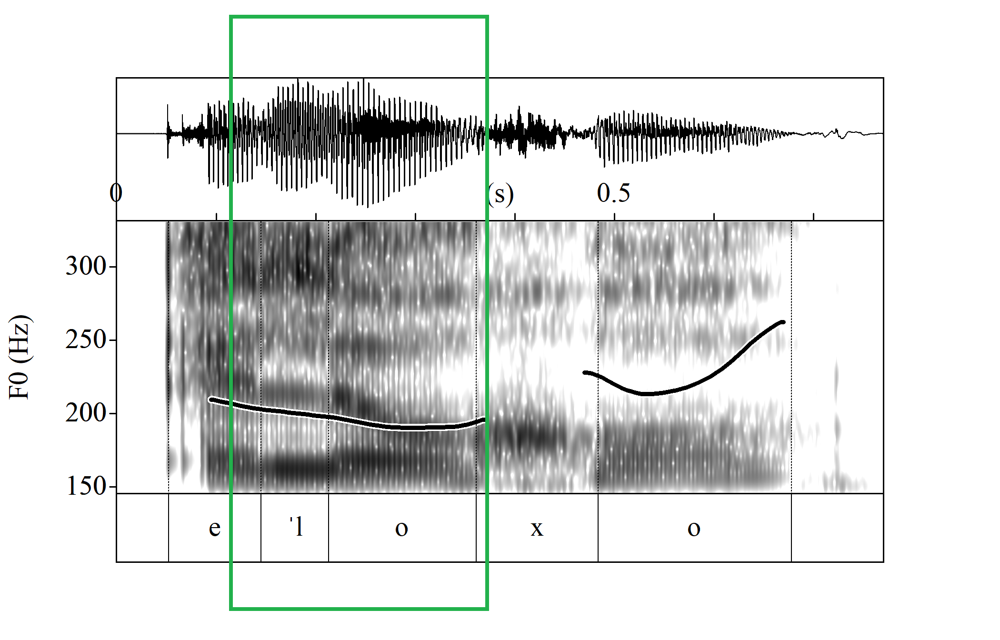
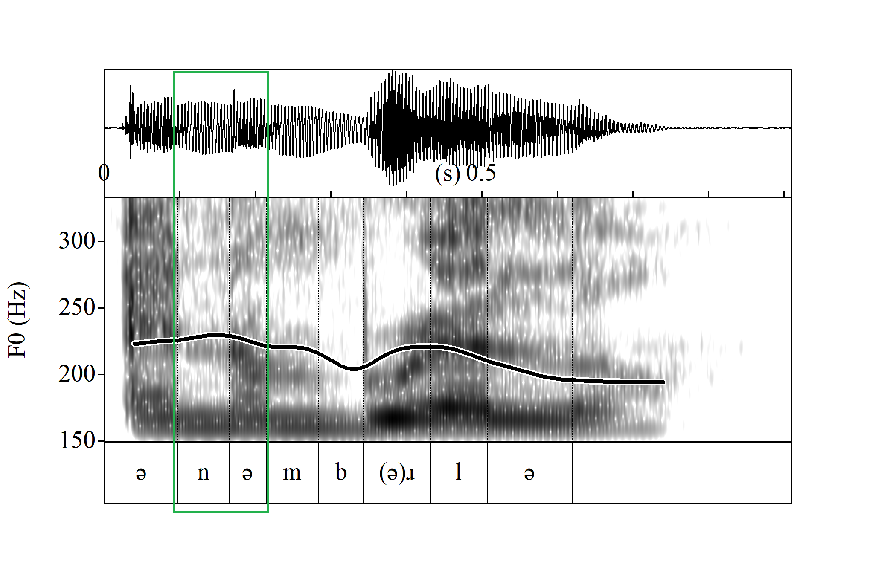
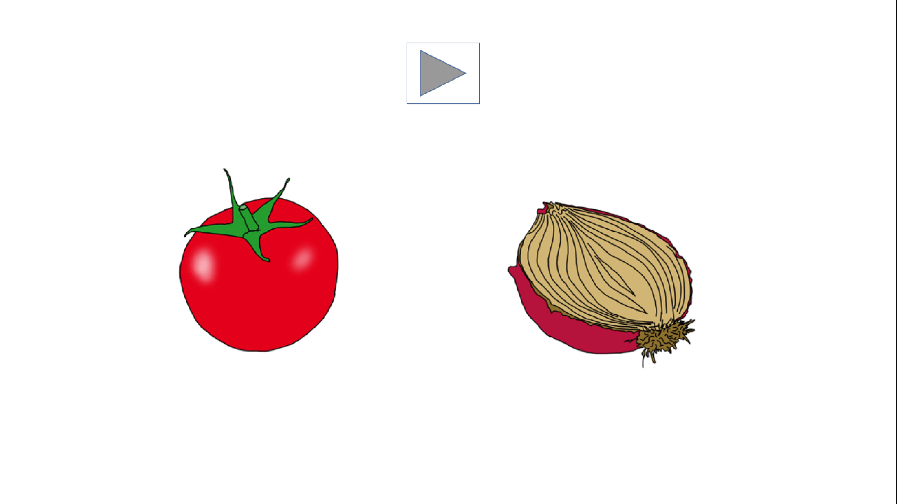
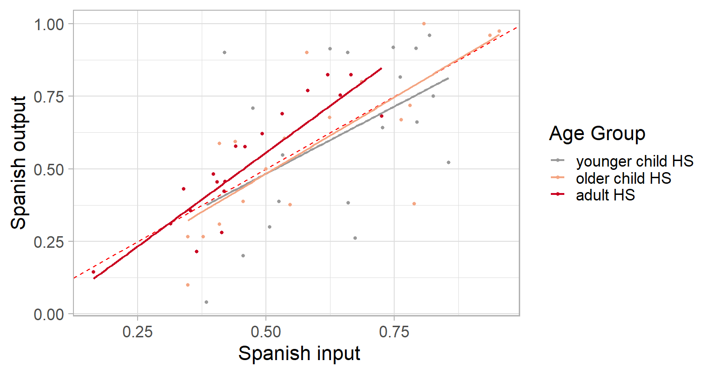
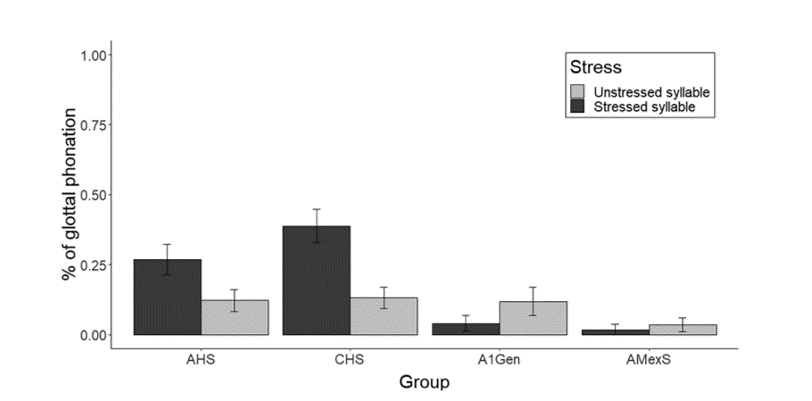

<!-- this adds the link footer to all slides, depends on my-footer class in css-->


```{css, echo = F}
.regression table {
  font-size: 12px;     
}

```

```{r setup, include=FALSE}
knitr::opts_chunk$set(echo = FALSE)
library(firatheme)
library(tidyverse)
library(xaringanthemer)
```

```{r}
xaringanExtra::use_logo(
  image_url = "logo.png",
  position = xaringanExtra::css_position(top = "1em", right = "1em")
)
```

```{r xaringan-themer, include=FALSE, warning=FALSE}
library(xaringanthemer)
style_mono_accent(
  base_color = "#1c5253",
  header_font_google = google_font("Times New Roman"),
  text_font_google   = google_font("Times New Roman", "300", "300i"),
  code_font_google   = google_font("Times New Roman"),
    text_font_size = "1rem",
  header_h1_font_size = "2rem",
    header_h3_font_size = "1.2rem"

  

)


```


# Preliminaries
'Glottalizing at word junctures: Exploring bidirectional transfer in child and adult
Spanish heritage speakers' in *Bilingualism: Language and Cognition*


With the support of the RA team:

Melissa Mendoza

Karina Eutimio

Ashley Cobian

Ana Sofia Rodriguez


```{r, echo = FALSE, out.width = "200px"}


```


---
```{r xaringan-panelset2, echo=FALSE}
xaringanExtra::use_panelset()
```
# Maintaining a heritage language


- Heritage speakers (HS): **Early bilinguals** who speak an immigrant language at home.  Close relationship to **ethnic identity**, ethnic social norms and values <font size="2">(Fillmore, 2000; S. Y. Kim & Chao, 2009)</font>. 

--

- Dominance shift heritage language → majority language during **primary school** <font size="2">(Benmamoun, Montrul, & Polinsky, 2013; Flores & Rato, 2016; Kupisch et al., 2015; Lloyd-Smith, Einfeldt, & Kupisch,2020; Polinsky & Scontras, 2020; Valdés, 2014)</font>.

--

- Younger heritage speakers are at risk of losing their heritage language <font size="2">(Carreira & Kagan, 2011; MacSwan, 2000; Porcel, 2006)</font>.

--

- Maintenance of the heritage language leads to a stronger sense of ethnic identity and self esteem <font size="2">(Lee & Oxelson, 2006)</font>, proficiency in both the heritage and the majority language <font size="2">(Agirdag & Vanlaar, 2018; Ganuza & Hedman, 2019)</font>.

--

- Spanish-English bilinguals raised in California with Spanish as their heritage language.


---

# The phonetic and phonological systems


- Adult HS demonstrate areas of **vulnerability in the heritage language** (HL):  divergent productions from monolingual norms, cross-linguistic transfer from the dominant language <font size="2">(Amengual, 2012, 2016; Kim, 2017; Rao, 2014; Ronquest, 2013)</font>, output variation <font size="2">(Kupisch, 2020)</font>, 'heritage accent' <font size="2">(Flores & Rato, 2016; Kupisch et al., 2015; Lloyd-Smith et al., 2020).</font>

--

-  Early-childhood bilinguals also show grammar interaction between their two grammars <font size="2"> (Vihman 1985, Lleó, & Rakow, 2004; Kehoe et al., 2004; Lleó, 2003, 2016b; Lleó & Kehoe, 2002) </font>.

--

But, missing studies connecting the ... <font size="2"> (Montrul & Sánchez, 2013; Montrul, 2018; Polinsky, 2018) </font>.

  - Attrition or grammar interaction throughout HSs linguistic development?

--

- **How are a bilinguals' two grammars encoded in their minds and how do they interact?**


```{r , include = FALSE}

library(htmltools)
html_tag_audio <- function(file, type = c("wav")) {
  type <- match.arg(type)
  htmltools::tags$audio(
    controls = "",
    htmltools::tags$source(
      src = file,
      type = glue::glue("audio/{type}", type = type)
    )
  )
}
```


---


# Connected speech

- Production of a sequence of two words 'el ojo' (*the eye*)
- Languages prefer syllables with an initial consonant /CV/ (e.g., [ka.sa] *casa* 'house') and disprefer syllables with no initial consonant /V/ (e.g., [oxo] *ojo* 'eye') <font size="2">(Blevins, 1995; Jakobson, 1968) </font>.

--


.pull-left[

### Spanish


Resyllabification: from  [e**l**.o.xo] to [e.**l**o.xo] 
  <font size="2">(Colina, 1997; Harris, 1983; Hualde, 2014)</font>.

```{r , include = FALSE}

library(htmltools)
html_tag_audio <- function(file, type = c("wav")) {
  type <- match.arg(type)
  htmltools::tags$audio(
    controls = "",
    htmltools::tags$source(
      src = file,
      type = glue::glue("audio/{type}", type = type)
    )
  )
}
```

```{r, echo = FALSE, results='asis'}
audio3 <- html_tag_audio("elojo_modal.wav", type = "wav")
print(audio3)

```


```{r, echo = FALSE, out.width = "300px"}

```


]
.pull-right[


### English

'a**n um**brella' /VC#V/ mostly linked speech in unstressed positions (ambisyllabicity) <font size="2">(Hayes, 2009, Kahn, 1976)</font>.


```{r, echo = FALSE, results='asis'}
audio4 <- html_tag_audio("./assets/img/anumbrella.wav", type = "wav")
print(audio4)

```


```{r, echo = FALSE, out.width = "300px"}

```


]

---

# Connected speech

Languages prefer to have syllables with an initial consonant <font size="2">(Blevins, 1995; Jakobson, 1968). </font>


.pull-left[

### Spanish


e**l o**jo 'the eye' /VC#V/ (e.g., [e**l**.o.xo]), resyllabified into /V#CV/ [e.**l**o.xo] -
  <font size="2">(Colina, 1997; Harris, 1983; Hualde, 2014)</font>.

```{r , include = FALSE}

library(htmltools)
html_tag_audio <- function(file, type = c("wav")) {
  type <- match.arg(type)
  htmltools::tags$audio(
    controls = "",
    htmltools::tags$source(
      src = file,
      type = glue::glue("audio/{type}", type = type)
    )
  )
}
```

```{r, echo = FALSE, results='asis'}
audio3 <- html_tag_audio("elojo_modal.wav", type = "wav")
print(audio3)

```


```{r, echo = FALSE, out.width = "300px"}

```


]
.pull-right[


### English

'a**n o**nion' /VC#V/ optionally produce a glottal stop /VC#ʔV/ in stressed positions <font size="2">(Garellek, 2013,2014; Pak, 2014,206)</font>.


```{r, echo = FALSE, results='asis'}
audio4 <- html_tag_audio("anonion.wav", type = "wav")
print(audio4)

```


```{r, echo = FALSE, out.width = "300px"}
knitr::include_graphics("./assets/img/anonion.png")
```


]
---

# Connected speech as a vulnerable area

.pull-left[
- Resyllabification can result in weak boundaries between the two words, has consequences for word retrieval and word learning.

  - *[so.xos] for [o.xos] <font size="2">(Hence, D’Introno, Ortiz, and Sosa,1989)</font>.
  
  
```{r, echo = FALSE, out.width = "300px"}

```


]

.pull-right[

- Glottal phonation enhances the boundaries between the words <font size="2">(Garellek, 2014)</font>, which may ease costs associated with word retrieval.

```{r, echo = FALSE, out.width = "300px"}
knitr::include_graphics("./assets/img/anonion.png")
```


]

.pull-left[

Spanish-like
```{r, echo = FALSE, results='asis'}
audio3 <- html_tag_audio("elojo_modal.wav", type = "wav")
print(audio3)

```

]
.pull-right[
English-like

```{r, echo = FALSE, results='asis'}
audio5 <- html_tag_audio("el_ojo_glottal1.wav", type = "wav")
print(audio5)

```

]
---

class: inverse, middle, center
## Research questions 


---
# Research questions 

### [Rate of glottal phonation: ↓ Spanish   ↑ English]


- Is the rate of **glottal phonation** different in the Spanish and English grammars of HSs when compared to monolingually-raised speakers?

   .pull-left[
 - **Spanish grammars**
```{r, message = FALSE, warning = FALSE}


library(ggplot2)

# Set seed for reproducibility
# create a data frame with two rows
df <- data.frame(stress = c("Monolinguals in Spanish", "Heritage speakers"),
                 value = c(0.2, 0.8))

# create the bar graph using ggplot2
ggplot(df, aes(x = stress, y = value)) +
  geom_bar(stat = "identity", width = 0.5) +
  labs(x = "Stress", y = "Proportion glottal phonation")+theme_xaringan()


```

]

 .pull-right[

 
 - **English grammars**
```{r, message = FALSE, warning = FALSE}
library(ggplot2)

# Load example dataset
data(mtcars)
df <- data.frame(stress = c("Monolinguals in English", "Heritage speakers"),
                 value = c(0.8, 0.2))

# create the bar graph using ggplot2
ggplot(df, aes(x = stress, y = value)) +
  geom_bar(stat = "identity", width = 0.5) +
  labs(x = "Stress", y = "Proportion glottal phonation")+theme_xaringan()


```

]

  
---
# Research questions 

### [Rate of glottal phonation: ↓ Spanish   ↑ English]


- Does the effect of **stress** mediate rate of glottal phonation in the phonologies of heritage bilinguals and age-matched monolingually-raised speakers?


```{r, message = FALSE, warning = FALSE, out.width = "400px"}
library(ggplot2)

# create a data frame with two rows
df <- data.frame(stress = c("Unstressed syllables", "Stressed syllables"),
                 value = c(0.2, 0.8))

# create the bar graph using ggplot2
ggplot(df, aes(x = stress, y = value)) +
  geom_bar(stat = "identity", width = 0.5) +
  labs(x = "Stress", y = "Proportion glottal phonation")+theme_xaringan()

```


---
# Research questions 

### [Rate of glottal phonation: ↓ Spanish   ↑ English]

- Does rate of glottal phonation change as heritage speakers **shift their dominance** from the heritage to the majority language?

 .pull-left[
 - **Heritage speakers in Spanish**
 
```{r, message = FALSE, warning = FALSE }
library(ggplot2)

# create a data frame with three rows
df <- data.frame(group = c("a_Younger Children", "b_Older Children", "c_Adults"),
                 value = c(0.2, 0.5, 0.8))

# create the bar graph using ggplot2
ggplot(df, aes(x = group, y = value)) +
  geom_bar(stat = "identity", width = 0.5) +
  geom_bar(stat = "identity", width = 0.5) +  scale_x_discrete(labels = c("Younger chil.", "Older chil.", "Adults")) +
  labs(x = "Age Group", y = "Prop. glottal phonation")+theme_xaringan()

```
 ]
 
  .pull-right[
 - **Heritage speakers in English**
 
 
```{r, message=FALSE, warning=FALSE}
library(ggplot2)

# create a data frame with three rows
df <- data.frame(group = c("a_Younger Children", "b_Older Children", "c_Adults"),
                 value = c(0.2, 0.5, 0.8))

# create the bar graph using ggplot2
ggplot(df, aes(x = group, y = value)) +
  geom_bar(stat = "identity", width = 0.5) +  scale_x_discrete(labels = c("Younger chil.", "Older chil.", "Adults")) +

  labs(x = "Age Group", y = "Prop. glottal phonation")+ theme_xaringan()

```
 ]

---
# Research questions 

### [Rate of glottal phonation: ↓ Spanish   ↑ English]


- Do **language exposure (i.e., input) and use (i.e., output)** explain grammar interaction?
 .pull-left[
 - **Heritage speakers in Spanish**
```{r, message= FALSE, warning=FALSE}


library(ggplot2)

# Set seed for reproducibility
set.seed(123)

# Generate random data
x <- rnorm(100, mean = 5, sd = 2)   # X variable with mean = 5, sd = 2
y <- x + rnorm(100, mean = 0, sd = 1) # Y variable with positive correlation to X

# Create plot with ggplot2
ggplot(data = data.frame(x, y), aes(x = x, y = y)) +
  labs(x = "Spanish input/output", y = "Prop glottal phonation") +
  geom_smooth(method = "lm", se = FALSE) +
  scale_x_continuous(breaks = NULL, expand = c(0,0)) +
  scale_y_continuous(breaks = NULL, expand = c(0,0))+theme_xaringan()


```

]

 .pull-right[

 
 - **Heritage speakers English**
```{r, message= FALSE, warning=FALSE}
library(ggplot2)

# Load example dataset
data(mtcars)

ggplot(mtcars, aes(x = hp, y = mpg)) +
  labs(x = "Spanish input/output", y = "Prop glottal phonation") +
  geom_smooth(method = "lm", se = FALSE) +
  scale_x_continuous(breaks = NULL, expand = c(0,0)) +
  scale_y_continuous(breaks = NULL, expand = c(0,0)) +
  theme_xaringan()

```

]


---
class: inverse, middle, center

## Methodology

---
# Production task: Spanish

Sequences of function + content words elicited with the function words:

.pull-left[

Function words:

  *   un 'an'
  *   dos 'two'
  *   el 'the'
  
| **Primary stress-initial syllable** | **Non-primary stress-initial syllable** |
|------------------------------------------|----------------------------------------------|
| árbol 'tree'                             | avión 'plane'                                |
| hombre 'man'                             | animal 'animal'                              |
| ojo 'eye'                                | espejo 'mirror'                              |
| ángel 'angel'                            | elefante 'elephant'                          |

]
.pull-right[

 

```{r, echo = FALSE, out.width = "400px"}
knitr::include_graphics("./assets/img/unaboca.png")
```

```{r, echo = FALSE, results='asis'}
audio3 <- html_tag_audio("./examples/audio28.wav", type = "wav")
print(audio3)

```

'Aquí hay una boca y aquí hay...'

'There is a mouth here and here there is...'

]

---

# Production task: English

Sequences of function + content words elicited with the function words:

.pull-left[

Function words:

  *   an
  *   this
  *   all
  
| **Primary stress-initial syllable** | **Non-primary stress-initial syllable** |
|------------------------------------------|----------------------------------------------|
| octopus                             | umbrella                                |
| island                            | aquarium                           |
| onion                                | iguana                              |
| olive                            | avocado                          |

]

.pull-right[


 

```{r, echo = FALSE, out.width = "400px"}

```


```{r, echo = FALSE, results='asis'}
audio3 <- html_tag_audio("./examples/audio7.wav", type = "wav")
print(audio3)

```

'This is a tomato and this is...'

]


---


# Language input and output


**Input**

* Percentage of Spanish heard at school
* Percentage of Spanish heard at home (caregiver 1, caregiver 2, younger siblings [if any],
older siblings [if any])
* Weighted by time spent in each environment with each speaker


**Output**


* Percentage of Spanish spoken at home (caregiver 1, caregiver 2, younger siblings [if any],
older siblings [if any])
* Weighted by time spent with each speaker


---
#  Participants


**Heritage speakers**

* Born in the US or arrived in the US before the age of 3.
*  Exposed to Spanish since birth and to English before the age of 5.
*   Had at least one caregiver that emigrated from Mexico (4 participants had one caregiver from El Salvador and one from Mexico, and two participants had a monolingually-raised English 
caregiver).

| Heritage Speakers | N (Ages)               | Spanish input (SD) | Spanish output (SD) |
|-------------------------------------|------------------------|-----------------------------|------------------------------|
| younger children                    | N = 19 (5;2 to 7;7)    | 65.78% (15.01%)           | 64.41% (27.80%)            |
| older children                      | N = 19 (8;2 to 11;11)  | 58% (20%)                 | 56% (27%)                  |
| adults                              | N = 21 (18;11 to 26;7) | 53% (21%)                 | 53% (21%)                  |


---

#  Participants

**Monolingually-raised Spanish speakers**

* Born and raised in Mexico and lived in Central Mexico or North-Central Mexico at the time of testing.
* Spoke no languages other than Spanish and English.


| SpanMonoS | N (Ages)                    | Spanish input (SD) | Spanish output (SD) |
|-----------------------------|-----------------------------|-----------------------------|------------------------------|
| younger children            | N = 21 (5;1 to 8 years)     | 86.98% (8%)               | 92.58% (7%)                |
| older children              | N = 23 (8 to 11;8 years)    | 91.52% (10.28%)           | 97.93% (4.47%)             |
| adults                      | N = 20 M = 20.87, SD = 1.99 | 87.50% (8.10%)            | 92.82% (7.15%)             |


---
#  Participants


**Monolingually-raised English speakers**
* English speakers from Southern California
* Either basic or no previous knowledge of Spanish 
* Neither exposed to Spanish at home nor spoke languages other than English daily.


| EngMonoS | N (Ages)              |
|----------------------------|-----------------------|
| younger children           | N = 20 (5;7 to 8)     |
| older children             | N = 22 (8;5 to 11;58) |
| adults                     | N = 20 (20.22)        |


---
# Categorical coding

.pull-left[
*Modal phonation*: Periodic speech signal, pulse-to-pulse regularity and amplitude regularity.


```{r, echo = FALSE, results='asis'}

audio56 <- html_tag_audio("anonionmodal.wav", type = "wav")
print(audio56)

```

```{r, echo = FALSE, out.width = "400px"}
knitr::include_graphics("./assets/img/anonionmodal.png")
```


]

.pull-right[


    

*Period of glottal phonation*: High degree of pulse-to-pulse irregularity and amplitude irregularity and/or a period of silence lower than 150 ms.


```{r, echo = FALSE, results='asis'}
audio4 <- html_tag_audio("anonion.wav", type = "wav")
print(audio4)

```


```{r, echo = FALSE, out.width = "400px"}
knitr::include_graphics("./assets/img/anonion.png")
```


]


---
# Categorical coding

.pull-left[
*Modal phonation*: Periodic speech signal, pulse-to-pulse regularity and amplitude regularity.

```{r, echo = FALSE, results='asis'}
audio3 <- html_tag_audio("elojo_modal.wav", type = "wav")
print(audio3)

```


```{r, echo = FALSE, out.width = "400px"}

```
]

.pull-right[

    

*Period of glottal phonation*: High degree of pulse-to-pulse irregularity and amplitude irregularity and/or a period of silence lower than 150 ms.


```{r, echo = FALSE, results='asis'}
audio4 <- html_tag_audio("unojo_creaky.wav", type = "wav")
print(audio4)

```


```{r, echo = FALSE, out.width = "400px"}
knitr::include_graphics("./assets/img/unojo_creakymarked.png")
```


]
---
class: inverse, middle, center

## Results

---
# Results: Type of Speaker Spanish

Prediction: ↑ Heritage speakers   ↓ Spanish monolinguals


<font size="2"> Stress * Age * Type.of.Speaker  + (1|Participant) + (1|Word) </font> 


```{r, echo = FALSE, warning = FALSE, message = FALSE,fig.height = 6, fig.width = 8, fig.align = "center"}
library(ggplot2)
library(Rmisc)
library(ggthemes)
library(lattice)
library(dplyr)

realwords.spanish <- read.csv('real_words_spanish_blc.csv', sep=',', header=T )
realwords.spanish.included <- droplevels(subset(realwords.spanish, Included %in% c('1')))
realwords.spanish.target <- droplevels(subset(realwords.spanish.included, target %in% c('yes')))
realwords.spanish.copies <- droplevels(subset(realwords.spanish.target, Copies %in% c('included')))


SE.rate <- summarySE(realwords.spanish.copies, measurevar="Glottal.rate", groupvars=c("Type.of.Speaker"), na.rm=TRUE )

p1 <- ggplot(SE.rate, aes(x=Type.of.Speaker, y=Glottal.rate)) + coord_cartesian(ylim = c(0, 0.5)) + geom_bar(colour = "black", stat= "identity", position = position_dodge()) + scale_x_discrete(breaks = c("monolingual", "bilingual"), labels = c("SpanMonoSs", "HSs"))+ theme_xaringan()+geom_errorbar(position=position_dodge(.9), width = .1, aes(ymin=Glottal.rate-se, ymax=Glottal.rate+se)) + labs(x="Type of speaker", y = "Prop of glottal phonation")  + guides(fill =guide_legend(reverse = TRUE)) +  
  annotate("text", x=1.5, y=0.4, label= "***", size = 10)  
p1
#p1 <- ggplotly(p1)
#p1 <- p1 %>% layout(legend = list(x = 1, y = 1.2, font=list(size=22))) %>%layout(autosize = F, width = 600, height = 400, list(
 # l = 100,
  #r = 40,
  #b = 100,
  #t = 50,
  #pad = 0
#))


#htmlwidgets::saveWidget(as_widget(p1)
 #                  , file = "./assets/img/plot.html")

#{r, 'diagrammer1', echo=FALSE, warning=FALSE,cache=FALSE,results='asis'}
#cat('<iframe src="./assets/img/plot.html" width=100% height=100% allowtransparency="true"> #</iframe>')


```


---
# Results: Stress Spanish

Prediction: ↑ Stressed syllables ↓ unstressed syllables


<font size="2"> Stress * Age * Type.of.Speaker  + (1|Participant) + (1|Word) </font> 

```{r spanishplot, echo = FALSE, include=TRUE, message = FALSE, fig.height = 6, fig.width = 8, fig.align = "center", warning = FALSE, message = FALSE}
library(ggthemes)
library(ggplot2)
library(Rmisc)
library(gganimate)
realwords.spanish <- read.csv('real_words_spanish_blc.csv', sep=',', header=T )
realwords.spanish.included <- droplevels(subset(realwords.spanish, Included %in% c('1')))
realwords.spanish.target <- droplevels(subset(realwords.spanish.included, target %in% c('yes')))
realwords.spanish.copies <- droplevels(subset(realwords.spanish.target, Copies %in% c('included')))

SE.rate <- summarySE(realwords.spanish.copies, measurevar="Glottal.rate",groupvars=c("Type.of.Speaker", "Stress"), na.rm=TRUE )


df_p_val <- data.frame(
  group1 = 'bilingual',
  group2 = 'bilingual',
  supp = 'yes',
  p.adj = 0.0606,
  y.position = 0.6
)


p1.rate <- ggplot(SE.rate, aes(x=Type.of.Speaker, y=Glottal.rate, fill = Stress)) + coord_cartesian(ylim = c(0, 1)) + geom_bar(colour = "black", stat= "identity", position = position_dodge()) + scale_x_discrete(breaks = c("monolingual", "bilingual"), labels = c("SpanMonoSs" ,"HSs"))+  theme_xaringan() +
  scale_xaringan_fill_discrete( name = "Stress of initial syllable", breaks = c("yes", "no"), labels = c("'el ojo' stressed ", "'el avión' unstressed ")) +  geom_errorbar(position=position_dodge(.9), width = .1, aes(ymin=Glottal.rate-se, ymax=Glottal.rate+se)) + labs(x="Type of Speaker", y = "Prop of glottal phonation")  +guides(fill =guide_legend(reverse = TRUE)) +  
  annotate("text", x=1, y=0.4, label= "***", size = 10) 


p1.rate


```


---
# Results: Age Spanish

Prediction: Younger children < older children < adults

<font size="2"> Stress * Age * Type.of.Speaker  + (1|Participant) + (1|Word) </font> 


```{r, echo = FALSE, warning = FALSE, message = FALSE,fig.height = 6, fig.width = 8, fig.align = "center"}
library(ggplot2)
library(Rmisc)
library(ggthemes)
library(lattice)
library(dplyr)

realwords.spanish <- read.csv('real_words_spanish_blc.csv', sep=',', header=T )
realwords.spanish.included <- droplevels(subset(realwords.spanish, Included %in% c('1')))
realwords.spanish.target <- droplevels(subset(realwords.spanish.included, target %in% c('yes')))
realwords.spanish.copies <- droplevels(subset(realwords.spanish.target, Copies %in% c('included')))


SE.rate <- summarySE(realwords.spanish.copies, measurevar="Glottal.rate", groupvars=c("Type.of.Speaker","Age.Group"), na.rm=TRUE )

p1 <- ggplot(SE.rate, aes(x=Age.Group, y=Glottal.rate, fill = Type.of.Speaker)) + coord_cartesian(ylim = c(0, 0.5)) + geom_bar(colour = "black", stat= "identity", position = position_dodge()) + scale_x_discrete(breaks = c("a_child", "b_child", "c_adult"), labels = c("young. child.", "old. child.", "adults"))+ theme_xaringan()+  scale_xaringan_fill_discrete(name = "Type of Speaker",breaks = c("monolingual", "bilingual"), labels = c("SpanMonoS","HSs"))+geom_errorbar(position=position_dodge(.9), width = .1, aes(ymin=Glottal.rate-se, ymax=Glottal.rate+se)) + labs(x="Age Groups", y = "Prop of glottal phonation")  + guides(fill =guide_legend(reverse = TRUE)) +  
  annotate("text", x=1, y=0.4, label= "***", size = 10) +  
  annotate("text", x=2, y=0.4, label= "**", size = 10) 
p1
#p1 <- ggplotly(p1)
#p1 <- p1 %>% layout(legend = list(x = 1, y = 1.2, font=list(size=22))) %>%layout(autosize = F, width = 600, height = 400, list(
 # l = 100,
  #r = 40,
  #b = 100,
  #t = 50,
  #pad = 0
#))


#htmlwidgets::saveWidget(as_widget(p1)
 #                  , file = "./assets/img/plot.html")

#{r, 'diagrammer1', echo=FALSE, warning=FALSE,cache=FALSE,results='asis'}
#cat('<iframe src="./assets/img/plot.html" width=100% height=100% allowtransparency="true"> #</iframe>')


```


---
# Results Spanish: Input and output 

Prediction: ↑ input / output in Spanish ↓ grammar interaction

<font size="2"> Stress + Age + Spanish input + Spanish output  + (1|Participant) + (1|Word), - Linear mixed model tested for multicollinearity (VIF Spanish input = 2.28, VIF Spanish output = 1.93). </font> 


.pull-left[


```{r, echo = FALSE, warning = FALSE, message = FALSE}
library(gridExtra)
realwords.spanish.bil <- droplevels(subset(realwords.spanish.copies, Type.of.Speaker %in% c('bilingual')))

SE.rate.bil.sp <- summarySE(realwords.spanish.bil, measurevar="Glottal.rate", groupvars=c("Participant"), na.rm=TRUE )


spanish.input <- summarySE(realwords.spanish.bil, measurevar="Glottal.rate", groupvars=c(  "Spanish_input"), na.rm=TRUE )
spanish.input.graph <- ggplot(spanish.input, aes(x=Spanish_input, y=Glottal.rate))   + geom_point()+ theme_xaringan()+geom_smooth(method = "lm")+labs(x=" Spanish input", y = "Prop of glottal phonation")+ theme_xaringan()+  annotate("text", x = -Inf, y = Inf, label = "p = 0.31", hjust = 0, vjust = 1, size = 5) 


spanish.input.graph

```
]
.pull-right[

```{r, echo = FALSE, warning = FALSE, message = FALSE}

spanish.output <- summarySE(realwords.spanish.bil, measurevar="Glottal.rate", groupvars=c(  "Spanish_output"), na.rm=TRUE )
spanish.output.graph <- ggplot(spanish.output, aes(x=Spanish_output, y=Glottal.rate))   + geom_point()+ theme_xaringan()+geom_smooth(method = "lm")+labs(x="Spanish output", y = "")+  annotate("text", x = -Inf, y = Inf, label = "p = 0.34", hjust = 0, vjust = 1, size = 5) 


spanish.output.graph


```

]


---
# Results: Type of Speaker English

Prediction: ↓ Heritage speakers   ↑ English monolinguals


<font size="2"> Stress * Age * Type.of.Speaker  + (1|Participant) + (1|Word) </font> 


```{r, echo = FALSE, warning = FALSE, message = FALSE,fig.height = 6, fig.width = 8, fig.align = "center"}
realwords.english <- read.csv('real_words_english_blc.csv', sep=',', header=T )
realwords.english.included <- droplevels(subset(realwords.english, included %in% c('1')))
realwords.english.target <- droplevels(subset(realwords.english.included, target %in% c('yes')))
realwords.english.copies <- droplevels(subset(realwords.english.target, match %in% c('included')))
SE.rate.eng1 <- summarySE(realwords.english.copies, measurevar="Glottal.rate", groupvars=c("Type.of.speaker"), na.rm=TRUE )

p1.rate.eng <- ggplot(SE.rate.eng1, aes(x=Type.of.speaker, y=Glottal.rate)) + coord_cartesian(ylim = c(0, 1)) + geom_bar(colour = "black", stat= "identity", position = position_dodge()) + scale_x_discrete(breaks = c("monolingual", "bilingual"), labels = c("EngMonoS", "HSs"))+ theme_xaringan() +  geom_errorbar(position=position_dodge(.9), width = .1, aes(ymin=Glottal.rate-se, ymax=Glottal.rate+se)) + labs(x="Age Groups", y = "Prop of glottal phonation")  + guides(fill =guide_legend(reverse = TRUE))+  
  annotate("text", x=1.5, y=0.8, label= "**", size = 10) 

p1.rate.eng

```


---
# Results: Stress English

Prediction: ↑ Stressed syllables ↓ unstressed syllables

<font size="2"> Stress * Age * Type.of.Speaker  + (1|Participant) + (1|Word) </font> 

```{r, echo = FALSE, warning = FALSE, message = FALSE,fig.height = 6, fig.width = 8, fig.align = "center"}

realwords.english <- read.csv('real_words_english_blc.csv', sep=',', header=T )
realwords.english.included <- droplevels(subset(realwords.english, included %in% c('1')))
realwords.english.target <- droplevels(subset(realwords.english.included, target %in% c('yes')))
realwords.english.copies <- droplevels(subset(realwords.english.target, match %in% c('included')))
SE.rate.eng1 <- summarySE(realwords.english.copies, measurevar="Glottal.rate", groupvars=c("Type.of.speaker" , "Stress"), na.rm=TRUE )

p1.rate.eng <-  ggplot(SE.rate.eng1, aes(x=Type.of.speaker, y=Glottal.rate, fill = Stress)) + coord_cartesian(ylim = c(0, 1)) + geom_bar(colour = "black", stat= "identity", position = position_dodge()) + scale_x_discrete(breaks = c("monolingual", "bilingual"), labels = c("EngMonoSs" ,"HSs"))+  theme_xaringan() +
  scale_xaringan_fill_discrete( name = "Stress of initial syllable", breaks = c("yes", "no"), labels = c("'an onion' stressed", "'an umbrella' unstressed")) +  geom_errorbar(position=position_dodge(.9), width = .1, aes(ymin=Glottal.rate-se, ymax=Glottal.rate+se)) + labs(x="Type of Speaker", y = "Prop of glottal phonation") +  guides(fill =guide_legend(reverse = TRUE)) + 
  annotate("text", x=1, y=0.9, label= "**", size = 10)  +  
  annotate("text", x=2, y=0.9, label= "***", size = 10) 

p1.rate.eng

```


    


---
# Results: Age English

Prediction: Younger children < older children < adults

<font size="2"> Stress * Age * Type.of.Speaker  + (1|Participant) + (1|Word) </font> 


```{r, echo = FALSE, warning = FALSE, message = FALSE,fig.height = 6, fig.width = 8, fig.align = "center"}
realwords.english <- read.csv('real_words_english_blc.csv', sep=',', header=T )
realwords.english.included <- droplevels(subset(realwords.english, included %in% c('1')))
realwords.english.target <- droplevels(subset(realwords.english.included, target %in% c('yes')))
realwords.english.copies <- droplevels(subset(realwords.english.target, match %in% c('included')))
SE.rate.eng1 <- summarySE(realwords.english.copies, measurevar="Glottal.rate", groupvars=c("Type.of.speaker","Age.Group"), na.rm=TRUE )

p1.rate.eng <- ggplot(SE.rate.eng1, aes(x=Age.Group, y=Glottal.rate, fill = Type.of.speaker)) + coord_cartesian(ylim = c(0, 1)) + geom_bar(colour = "black", stat= "identity", position = position_dodge()) + scale_x_discrete(breaks = c("a_child", "b_child", "c_adult"), labels = c("young. child.", "old. child.", "adults"))+ theme_xaringan()+
  scale_xaringan_fill_discrete( name = "Type of Speaker",breaks = c("monolingual", "bilingual"), labels = c("EngMonoS", "HSs")) +  geom_errorbar(position=position_dodge(.9), width = .1, aes(ymin=Glottal.rate-se, ymax=Glottal.rate+se)) + labs(x="Age Groups", y = "Prop of glottal phonation")  + guides(fill =guide_legend(reverse = TRUE))
p1.rate.eng

```

---
## English: Input and output 

Prediction:   ↑ input / output in Spanish ↑ grammar interaction


<font size="2"> Stress + Age + Spanish input + Spanish output  + (1|Participant) + (1|Word), Linear mixed model tested for multicollinearity (VIF Spanish input = 2.68, VIF Spanish output = 2.39) </font> 


.pull-left[
```{r, echo = FALSE, warning = FALSE, message = FALSE}
realwords.english.bil <- droplevels(subset(realwords.english.copies, Type.of.speaker %in% c('bilingual')))

SE.rate.bil.en <- summarySE(realwords.english.bil, measurevar="Glottal.rate", groupvars=c("Participant"), na.rm=TRUE )

english.input <- summarySE(realwords.english.bil, measurevar="Glottal.rate", groupvars=c(  "Spanish.input"), na.rm=TRUE )
english.input.graph <- ggplot(english.input, aes(x=Spanish.input, y=Glottal.rate))   + geom_point()+geom_smooth(method = "lm")+labs(x=" Spanish input", y = "Prop of glottal phonation")+ theme_xaringan()+   annotate("text", x = -Inf, y = Inf, label = "p = 0.43", hjust = 0, vjust = 1, size = 5) 


english.input.graph

```
]
.pull-right[

```{r, echo = FALSE, warning = FALSE, message = FALSE}


english.output <- summarySE(realwords.english.bil, measurevar="Glottal.rate", groupvars=c(  "Spanish.output"), na.rm=TRUE )
english.output.graph <- ggplot(english.output, aes(x=Spanish.output, y=Glottal.rate))   + geom_point()+geom_smooth(method = "lm")+labs(x="Spanish output", y = "")+ theme_xaringan()+   annotate("text", x = -Inf, y = Inf, label = "p = 0.22", hjust = 0, vjust = 1, size = 5) 
english.output.graph

```

]


---
class: inverse, middle, center

## Discussion

---

#  Discussion: Heritage language

**Majority language → heritage language?**

--

- ↑ Heritage speakers   ↓ Spanish monolinguals and  ↑ Stressed syllables ↓ unstressed syllables in the hertiage speakers.

- **Connected speech is a site for cross-linguistic transfer**. 

  - Transfer of strategies from the majority language in areas that are costly (implications for word retrieval) and used to express prominence <font size="2">(Bullock, 2008; Kim 2019) </font>.

--

**↓ Language transfer with ↑ age?**

- Younger children > older children > adults.

- Child heritage language grammars are **more permeable** to transfer than adult grammars. 
    - Bilingual language control <font size="2">(Branzi, Calabria, Boscarino, & Costa, 2016; Kubota, et al. 2020)</font>.

--

**Influence of input or output?**

- No, but input and output were aggregated scores. 
  - Decomposition of input and output.
- Sociocultural affiliation
- Cognition

---

#  Discussion: Majority language

**Heritage language to → majority language**

--

- Partial support: Lower rate of glottal phonation, but no change with age or input/output effect.

--

Overall lower rate of glottal phonation (lack of effect of age) may indicate the acquisition of the sound system of the speech community (i.e., input type).

  - **Chicano English**: greater monophtonguization of vowels, lesser vowel reduction, or Spanish-like place of articulation of stops (Santa Ana, 1991; Santa Ana and Bayley 2008;Fought, 2003).

  - Child-directed speech from the caregivers to understand whether and how children acquire a possible sound change at the community level (Roberts, 1997; Roberts & Labov, 1995; Rutter, 2014; Smith et al., 2007, 2009)


---

#  Takeaways 


- Connected speech strategies constitute a site of grammar interaction. Heritage speakers may adopt strategies from the majority language when not doing so could have consequences for **word retrieval**.


--


- Child HL grammars more vulnerable than adult HL grammars, child heritage speakers may still be developing skills to **suppress the non-intended language**.

--

- Possible **sound change** in Latino (Chicano)- English in California due to a language contact situation.


--

- Variation not explained by aggregated input and output.  

  
 


---
# Social impact


-  Fostering of **heritage language programs**: informing policies in heritage language programs.

--

- **Integrated approach** to teaching pronunciation, e.g., increased lexicon can have consequences for connected speech production.
--


-  Strengthening of the **link between academia, language immersion school programs, and minority linguistic communities**.


--


- Direct social benefit for **research participants** and **research participants**
  


---
# Selected references

.font50[
Amengual M (2012) Interlingual influence in bilingual speech: Cognate status effect in a continuum of bilingualism. Bilingualism: Language and Cognition 15, 517–530. https://doi.org/10.1017/S1366728911000460

Colina S (1997) Identity constraints and Spanish resyllabification. Lingua 103, 1–23. https://doi.org/10.1016/S0024-3841(97)00011-9

Embick D, White Y and Tamminga M (2020) Heritage languages and variation: Identifying shared factors. In Bilingualism (Vol. 23, Issue 1). https:// doi.org/10.1017/S136672891900047

Fabiano-Smith L and Barlow J (2010) Interaction in bilingual phonological acquisition: evidence from phonetic inventories. International Journal of Bilingual Education and Bilingualism 13, 81–97. https://www.tandfonline. com/doi/pdf/10.1080/13670050902783528

Fought C (2003) Chicano English in Context. In Chicano English in Context. https://doi.org/10.1057/9780230510012

Garellek M (2014) Voice quality strengthening and glottalization. Journal of Phonetics 45, 106–113. https://doi.org/10.1016/j.wocn.2014.04.001

Green DW and Abutalebi J (2013) Language control in bilinguals: The adaptive control hypothesis. Journal of Cognitive Psychology 25(5). https://doi.org/10.1080/20445911.2013.796377

Hayes B (2009) Syllabification in English. Introductory Phonology 20.
]
---
# Selected references


Ivanova-Sullivan T, Sekerina IA, Tofighi D and Polinsky M (2022) Language-Internal Reanalysis of Clitic Placement in Heritage Grammars Reduces the Cost of Computation: Evidence from Bulgarian. Languages 7 (1). https://doi.org/10.3390/languages7010024

Kahn D (1976) Syllable-based generalizations in English phonology [Massachusetts
Institute of Technology]. https://doi.org/10.4324/9781315688121

Kim JY and Repiso-Puigdelliura G (2021) Keeping a critical eye on majority
language influence: the case of uptalk in heritage Spanish. Languages 6,
1–27. https://doi.org/10.3390/languages6010013

Kupisch T (2020). Towards modeling heritage speakers’ sound systems.
Bilingualism: Language and Cognition 23, 29–30. https://doi.org/10.1017/
S1366728919000385

Polinsky M (2018) Bilingual children and adult heritage speakers: The range
of comparison. International Journal of Bilingualism 22, 547–563. https://
doi.org/10.1177/1367006916656048

Polinsky M and Scontras G (2020) Understanding heritage languages.
Bilingualism: Language and Cognition 23, 4–20. https://doi.org/10.1017/
S1366728919000245

Repiso-Puigdelliura G and Kim JY (2021) The missing link in Spanish heritage trill production. Bilingualism 24, 454–466. https://doi.org/10.1017/
S1366728920000668

Rothman J (2007) Heritage speaker competence differences, language change,
and input type: Inflected infinitives in Heritage Brazilian Portuguese.
International Journal of Bilingualism 11, 359–389. https://doi.org/10.1177/
13670069070110040201


]


---
class: inverse, middle, center


# Dankjewel

# ¡Gracias!


# Gràcies!


---
name: mylastslide


---
# Results: HS' Spanish-English phonologies


```{r, echo = FALSE, warning = FALSE, message = FALSE,fig.height = 6, fig.width = 8, fig.align = "center"}
realwords.spanish.bil <- droplevels(subset(realwords.spanish.copies, Type.of.Speaker %in% c('bilingual')))
realwords.english.bil <- droplevels(subset(realwords.english.copies, Type.of.speaker %in% c('bilingual')))


SE.rate.bil.sp <- summarySE(realwords.spanish.bil, measurevar="Glottal.rate", groupvars=c("Participant"), na.rm=TRUE )
SE.rate.bil.en <- summarySE(realwords.english.bil, measurevar="Glottal.rate", groupvars=c("Participant"), na.rm=TRUE )

jointdataset <- cbind(SE.rate.bil.sp, SE.rate.bil.en)
colnames(jointdataset) <- c("Participant.ES",  "N.ES",            "Glottal.rate.ES", "sd.ES"          , "se.ES" ,          "ci.ES",          
                             "Participant.EN" , "N.EN"  ,          "Glottal.rate.EN", "sd.EN",           "se.EN",           "ci.EN"         )

ggplot(aes(x=Glottal.rate.EN,y=Glottal.rate.ES),data=jointdataset)+geom_abline( colour = "red", linetype = "dashed")+
  geom_point()+ theme_xaringan()+geom_smooth(method = "lm", se=FALSE)+labs(subtitle = 'R = 0.5, p < 0.001', x=" Glottal rate English", y = "Glottal rate Spanish", color = 'Age Group')+scale_color_fira(labels = c('younger child HS','older child HS','adult HS'))


```


---


---
#  Discussion

### English


- Lower rates of glottal phonation not specific to child bilingualism.


  - Overall lower rate of glottal phonation at the community level (i.e., input type).
  
   * The lack of transfer in English could be explained with the fact that bilinguals require less inhibition to suppress the heritage language than to inhibit the majority language (e.g., Meuter and Allport, 1999, Peeters et al., 2014; for reviews see, Bobb and Wodniecka, 2013, Declerck and Philipp, 2015).


  - Overall lower rate of glottal phonation at the individual level.
  
  * Initial childhood transfer remains into adulthood. The difference in the nature of transfer between Spanish (i.e., categorical) and English (i.e., gradient) phonologies might explain why Spanish heritage speakers maintain divergent outcomes in English but not in Spanish.
 


---

# Participants: Language input and output

Language input and output are highly correlated 

```{r, echo = FALSE, out.width = "800px"}

```


---

# Understanding vulnerability


- Coactivation varies depending on **language dominance** .inverse-text-color[(Carrasco-Ortiz, et al., 2021; Muxika-Loitzate, 2021; Shea, 2019)].

  - During the **primary school years** dominance shift → the majority language as they gain exposure to the majority language
(Benmamoun, Montrul, & Polinsky, 2013; Flores & Rato, 2016; Kupisch et al., 2015; Lloyd-Smith, Einfeldt, & Kupisch,2020; Polinsky & Scontras, 2020; Valdés, 2014).


---
# Repiso-Puigdelliura 2021 Participants


 Child Spanish HS (CHS) (10 F, six M, mean age = 9.44 years, SD = 0.69)
 adult Spanish HS (AHS) (13 F, two M, mean age = 20.6 years, SD = 1.12)
 adult Spanish speakers in Mexico (AMexS) (six F, four M, mean age = 22.88, SD = 1.64) first-generation long-term immigrants (A1Gen) (seven F, two M, mean age = 45.16years, SD = 9.49)


---
# Categorical coding

.pull-left[
*Modal phonation*: Periodic speech signal, pulse-to-pulse regularity and amplitude regularity.


```{r, echo = FALSE, results='asis'}

audio56 <- html_tag_audio("anonionmodal.wav", type = "wav")
print(audio56)

```

```{r, echo = FALSE, out.width = "400px"}
knitr::include_graphics("./assets/img/anonionmodal.png")
```


]

.pull-right[


    

*Period of glottal phonation*: High degree of pulse-to-pulse irregularity and amplitude irregularity and/or a period of silence lower than 150 ms.


```{r, echo = FALSE, results='asis'}
audio4 <- html_tag_audio("anonion.wav", type = "wav")
print(audio4)

```


```{r, echo = FALSE, out.width = "400px"}
knitr::include_graphics("./assets/img/anonion.png")
```


]


---
# Categorical coding

.pull-left[
*Modal phonation*: Periodic speech signal, pulse-to-pulse regularity and amplitude regularity.

```{r, echo = FALSE, results='asis'}
audio3 <- html_tag_audio("elojo_modal.wav", type = "wav")
print(audio3)

```


```{r, echo = FALSE, out.width = "400px"}

```
]

.pull-right[

    

*Period of glottal phonation*: High degree of pulse-to-pulse irregularity and amplitude irregularity and/or a period of silence lower than 150 ms.


```{r, echo = FALSE, results='asis'}
audio4 <- html_tag_audio("unojo_creaky.wav", type = "wav")
print(audio4)

```


```{r, echo = FALSE, out.width = "400px"}
knitr::include_graphics("./assets/img/unojo_creakymarked.png")
```


]

---
class: regression

# Model for Spanish

```{r , include=FALSE, message = FALSE, hidden = TRUE}
library(lme4)
library(lmerTest)
library(forcats)
library(emmeans)
library(Rmisc)
library(tidyverse)


realwords.spanish <- read.csv('real_words_spanish_blc.csv', sep=',', header=T )
realwords.spanish.included <- droplevels(subset(realwords.spanish, Included %in% c('1')))
realwords.spanish.target <- droplevels(subset(realwords.spanish.included, target %in% c('yes')))
realwords.spanish.copies <- droplevels(subset(realwords.spanish.target, Copies %in% c('included')))


realwords.spanish.copies1 <- droplevels(subset(realwords.spanish.included, Copies %in% c('included')))
realwords.spanish.copies2 <- droplevels(subset(realwords.spanish.copies1, target %in% c('yes')))

realwords.spanish.copies$Age.Group <- as.factor(realwords.spanish.copies$Age.Group)
realwords.spanish.copies$Consonant <- as.factor(realwords.spanish.copies$Consonant)
realwords.spanish.copies$Stress <- as.factor(realwords.spanish.copies$Stress)
realwords.spanish.copies$Type.of.Speaker <- as.factor(realwords.spanish.copies$Type.of.Speaker)


realwords.spanish.copies$Type.of.Speaker <- relevel(realwords.spanish.copies$Type.of.Speaker , "monolingual")
realwords.spanish.copies$Stress <- relevel(realwords.spanish.copies$Stress , "yes")

c1 = contr.treatment(3)
my.coding1 <- matrix(rep(1/3, 6), ncol = 2)
my.simple1 <- c1-my.coding1
contrasts(realwords.spanish.copies$Age.Group) <- my.simple1
c1 = contr.treatment(3)
my.coding1 <- matrix(rep(1/3, 6), ncol = 2)
my.simple1 <- c1-my.coding1
contrasts(realwords.spanish.copies$Consonant) <- my.simple1
c2 = contr.treatment(2)
my.coding1 <- matrix(rep(1/2, 2), ncol = 1)
my.simple1 <- c2-my.coding1
contrasts(realwords.spanish.copies$Stress) <- my.simple1
c2 = contr.treatment(2)
my.coding1 <- matrix(rep(1/2, 2), ncol = 1)
my.simple1 <- c2-my.coding1
contrasts(realwords.spanish.copies$Type.of.Speaker) <- my.simple1


glottal.lmer <- glmer(Glottal.rate ~   Age.Group  *Stress * Type.of.Speaker  + (1|Participant) + (1|vowel)+(1|Consonant), family = "binomial", glmerControl(optimizer = "bobyqa", optCtrl = list(maxfun = 100000)),data = realwords.spanish.copies); 
summary(glottal.lmer)

```


```{r message=FALSE, results='asis'} 
library(tidyverse)
library(broom)
library(stargazer)

stargazer(glottal.lmer, type = "html", single.row = T)


```


---

# Understanding vulnerability


- How does the majority language influence the heritage language?

  - The two grammars are **interconnected** and may coactivate at the time of speech production  (Flege, 1994; Glege & Bohn, 2020, Godrick et al., 2016; Hernandez et al. 2005,
MacWhinney 2005, 2008).

   -  HSs **suppress the non-intended language** with language control networks that allow them to activate the target phonology .inverse-text-color[(Branzi, Calabria, Boscarino, & Costa, 2016)].
   

 - Cognitively demanding processes may strain the HSs' resources and may lead to the adoption of structures from the majority language (Ivanova-Sullivan, Sekerina, Tofighi, & Polinsky, 2022).

  - Bilingual language control continues to develop until **late-childhood** (Kubota et al., 2020).


???
- Areas showing divergences from canonical descriptions may be those that are more **vulnerable** to the effects of the majority language.


---
# Model for English


```{r , include=FALSE, message = FALSE, hidden = TRUE, warnings = FALSE}


realwords.english <- read.csv('real_words_english_blc.csv', sep=',', header=T )
realwords.english.included <- droplevels(subset(realwords.english, included %in% c('1')))
realwords.english.target <- droplevels(subset(realwords.english.included, target %in% c('yes')))
realwords.english.copies <- droplevels(subset(realwords.english.target, match %in% c('included')))

realwords.english.copies1 <- droplevels(subset(realwords.english.included, match %in% c('included')))
realwords.english.copies2 <- droplevels(subset(realwords.english.copies1, target %in% c('yes')))

realwords.english.copies$Age.Group <- as.factor(realwords.english.copies$Age.Group)
realwords.english.copies$Consonant <- as.factor(realwords.english.copies$Consonant)
realwords.english.copies$Stress <- as.factor(realwords.english.copies$Stress)
realwords.english.copies$Type.of.speaker <- as.factor(realwords.english.copies$Type.of.speaker)


realwords.english.copies$Type.of.speaker <- relevel(realwords.english.copies$Type.of.speaker , "monolingual")
realwords.english.copies$Stress <- relevel(realwords.english.copies$Stress , "yes")

c1 = contr.treatment(3)
my.coding1 <- matrix(rep(1/3, 6), ncol = 2)
my.simple1 <- c1-my.coding1
contrasts(realwords.english.copies$Age.Group) <- my.simple1
c1 = contr.treatment(3)
my.coding1 <- matrix(rep(1/3, 6), ncol = 2)
my.simple1 <- c1-my.coding1
contrasts(realwords.english.copies$Consonant) <- my.simple1
c2 = contr.treatment(2)
my.coding1 <- matrix(rep(1/2, 2), ncol = 1)
my.simple1 <- c2-my.coding1
contrasts(realwords.english.copies$Stress) <- my.simple1
c2 = contr.treatment(2)
my.coding1 <- matrix(rep(1/2, 2), ncol = 1)
my.simple1 <- c2-my.coding1
contrasts(realwords.english.copies$Type.of.speaker) <- my.simple1

library(optimx)
glottal.lmer.eng <- glmer(Glottal.rate ~   Age.Group  *Stress * Type.of.speaker+  (1|Participant) + (1|vowel)+(1|Consonant) , family = "binomial",  glmerControl(optimizer ='optimx', optCtrl=list(method='nlminb')),data = realwords.english.copies); 

```


```{r message=FALSE, results='asis'} 
library(tidyverse)
library(broom)
library(stargazer)

stargazer(glottal.lmer.eng, type = "html", single.row = T)


```


---
# Maintaining a heritage language


- Some areas in the pronunciation of the HL show divergences from non-heritage grammars .inverse-text-color[(Amengual, 2012, 2016; Henriksen, 2015; Kim & Repiso-Puigdelliura, 2020; Kirkham & McCarthy, 2020; Kupisch, 2020; Menke, 2018;Rao, 2014; Repiso-Puigdelliura & Kim, 2021)]


Repiso-Puigdelliura & Kim (2021): 9-to-10 y.o. still developing phonetic trill, later than monolinguals (Acevedo, 1993, Bosch, 1983)


'perro' strong trill
```{r, echo = FALSE, results='asis'}
audio0 <- html_tag_audio("./examples/perro_strong_trill.wav", type = "wav")
print(audio0)
```


'perro' weak trill
```{r, echo = FALSE, results='asis'}
audio0 <- html_tag_audio("./examples/perro_weak.wav", type = "wav")
print(audio0)
```


'perrito' tap
```{r, echo = FALSE, results='asis'}
audio0 <- html_tag_audio("./examples/perrito_tap.wav", type = "wav")
print(audio0)
```


---
# Discussion: Heritage language

**Alternative explanation**: child heritage speakers are exposed to an input containing more glottal stops.

Repiso-Puigdelliura (2021)


```{r, echo = FALSE, out.width = "800px"}

```

???

 Child Spanish HS (CHS) (10 F, six M, mean age = 9.44 years, SD = 0.69)
 adult Spanish HS (AHS) (13 F, two M, mean age = 20.6 years, SD = 1.12)
 adult Spanish speakers in Mexico (AMexS) (six F, four M, mean age = 22.88, SD = 1.64) first-generation long-term immigrants (A1Gen) (seven F, two M, mean age = 45.16years, SD = 9.49)


---
# Maintaining a heritage language


  - Implementation of phonetic detail (Amengual, 2012; Colantoni et al., 2016)
  - Articulatory complex sounds (Amengual, 2016; Menke, 2018; Repiso-Puigdelliura & Kim, 2021)
  - Prominence-related strategies (Kim, 2019)

--

  
  - Input and output (Kim & Repiso-Puigdelliura, 2020; Rao, 2014)
  - Language proficiency
  - Sociocultural affiliation (Kissling, 2018)
  - Cognition


---

#  What next?


**What is the effect of input type?**

* Examination of VOT in English heritage speakers raised by Spanish-Catalan bilinguals. Joint work with Katrina Blog.

* Do the HSs' caregivers trill their R's? Examining individual variation in the acquisition of rhotics. SSHRC Explore – Standard Research and Creative and Performing Arts Grant $6,967.00


**Can we see effects of the heritage language in the majority language in other areas**

* 'He's got abejas': the effects of code-switching in the English tapping rule. Joint work with Hiro Katsuda and Kie Zuraw.

**Is connected speech also a vulnerable area in sequential bilinguals?**

* Hiatus repair strategies in L3 Catalan speakers who are L1 English bilinguals and L3 English speakers who are Spanish-Catalan bilinguals.


**Relationship between cognition and phonological transfer**


* Do inhibitory skills predict language transfer in child bilinguals? 

* If so, does the effect of inhibitory skills vary as the child bilinguals' grammars develop and reach their end states?


  - Possible interaction language transfer and cognition.
  - Cross-sectional studies are key to better understand the process by which HSs reach their adult grammars. 
- Results do not support evidence for a threshold of language exposure and use.
  - Explore further sources of variation (e.g., sociocultural affiliation, cognition) and decompose sources of input and output.
  
---

# Grammar interaction


- How does the majority language influence the heritage language?


--
  - The two grammars are **interconnected** and may coactivate at the time of speech production  <font size="2">(Flege, 1994; Glege & Bohn, 2020, Godrick et al., 2016; Hernandez et al. 2005,
MacWhinney 2005, 2008)</font>.


--
   -  Heritage speakers **suppress the non-intended language** with language control networks that allow them to activate the target phonology <font size="2">(Branzi, Calabria, Boscarino, & Costa, 2016)</font>.
   
--
  
  -   Cognitively demanding processes may strain the HSs' resources and may lead to the adoption of structures from the majority language <font size="2">(Ivanova-Sullivan, Sekerina, Tofighi, & Polinsky, 2022)</font>.


  - Diversity in learning trajectories leading to heterogeneity in heritage language speech production <font size="2">(Chang & Yao, 2022; Kupisch, 2020)</font>.
  
--

...what predicts individual differences?

--


  - Cross-linguistic transfer from the dominant language <font size="2"> (Amengual, 2012, 2016; Kim, 2017; Rao, 2014;Ronquest, 2013)</font>. 
  
--
  
...when does it develop?


--
  
  
Some areas of the phonetic and phonological system appear to be more vulnerable than others <font size="2">(Amengual, 2012; Au et al., 2002, 2008; Chang et al., 2011; Godson, 2004; Saadah, 2011)</font>.
  
--

...but which ones?

... and why?


---

# Phonetics and Phonology: Heritage speakers


--
- How does the heritage language develop throughout childhood and into adulthood?

--

- Are the heritage language and the majority language equally vulnerable?

--


- What are the areas of vulnerability in heritage language grammars?

--

- What factors predict vulnerability in the heritage language?


